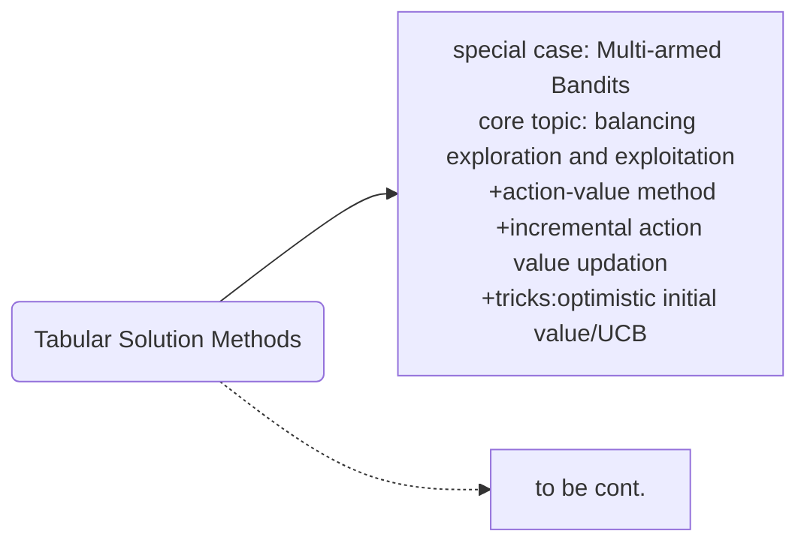
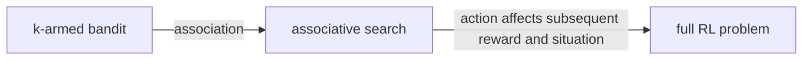

## chapter2 Multi-armed Bandits
this is the first chapter of part1: Tabular Solution Methods, which gives a simple case of RL where only one state exists in the state space.
Here we are:

Recall differences between RL and supervised learning:
RL: evaluate actions, need for active exploration
supervised learning: instruct actions, independently of the action actually taken.

#### 2.1 k-armed bandit problem description
+ only one situation,
+ but k actions can be taken in every time step
+ each action corresponds to a stationary distribution of the reward after this action is taken
+ Agent's goal is to maximize expected total reward. What's the policy?

Define value of action $a$ as :
$$q_*(a)=E[R_t|A_t=a]$$
The agent estimates $q_*(a)$ by $Q_t(a)$
+ if $Q_t(a)$ is precise enough, then always choose action with the highest $Q_t(a)$
+ however, most of time $Q_t(a)$ is not accurate estimate of $q_*(a)$, *exploration* is needed to do trial-and-error
+ since *exploitation* and *exploration* can not be done in one step, there is conflict

how to balance *exploiraton* and *exploration*?

#### 2.2 action-value methods
need to answer:
+ 1.how to estimate values of actions?
+ 2.how to use action values to make action decisions?

An easy way to estimate action value is just sample-average:
$$Q_t(a)=\frac{\sum_{i=1}^{t-1}{R_i \cdot \Bbb{1}_{A_i=a}}}{\sum_{i=1}^{t-1}\Bbb{1}_{A_i=a}}\qquad\qquad(2.1)$$

using $\varepsilon$-greedy method as action selection:
+ 1-$\varepsilon$ probability choose $A_t={\rm argmax_{a}}Q_t(a)$
+ $\varepsilon$ probability randomly choose all actions

what about the effectiveness of $\varepsilon$-greedy method?

#### 2.3 10-armed testbed
$\varepsilon$-greedy performs well when:
+ reward variance is large(nondeterministic)
+ when the true values of actions change over time(nonstationary)
+ when different states included, each action selection can be viewed as a bandit given current state($q(a|s)$)

$\bigstar$a small $\varepsilon$ usually surpasses a zero and a large $\varepsilon$ plicy.

#### 2.4 incremental implementation
easy to update action value from time step $t$ to $t+1$, n is the number of times action $a$ takes:
$$Q_{n+1}=\frac{1}{n}\sum_{i=1}^nR_i=Q_n+\frac{1}{n}[R_n-Q_n]\qquad\qquad(2.3)$$
follows the general form:
$$NewEstimate\leftarrow OldEstimate+StepSize[Target-OldEstimate]\qquad\qquad(2.4)$$
+ $Target$: desirable diection in which to move the estimate
+ $Target-OldEstimate$: an error
+ $StepSize$ has a general form: $\alpha_t(a)$

$\bigstar$action value updation includes nongreedy action's reward which is different from value function updation.

#### 2.5 tracking a nonstationary problem
higher weight on the most recent rewards and lower weight on the old rewards by using a constant step size $\alpha$.
$$Q_{n+1}=Q_n+\alpha[R_n-Q_n]\qquad\qquad(2.5)\newline =(1-\alpha)^nQ_1+\sum_{i=1}^n\alpha(1-\alpha)^{n-i}R_i \;(2.6)$$
which is a exponential-weighted average.

more generally, if $\alpha$ ia not constant, instead it changes over time, say $\alpha_n$, then the incremental action value estimate will be:
$$Q_{n+1}=\prod_{i=1}^n(1-\alpha_i)Q_1+\alpha_i\prod_{j=i+1}^n(1-\alpha_j)R_i+\alpha_nR_n\qquad(exercise 2.4)$$

following conditions assure the estimate will converge to true action value with probability of 1:
$$\sum_{i=1}^\infty\alpha_i=\infty\qquad\qquad\sum_{i=1}^\infty\alpha_i^2<\infty\qquad\qquad(2.7)$$
here, sample-average step size satisfies condition while constant step size not. However, constant alpha will never completely converge but continue to vary in response to the most recently received rewards, which is desirable to nonstationary environment.

#### 2.6 optimistic initial value
$Q_1(a)$ actually has impact on the convergence position of estimate, or biased by their initial estimates.
+ for sample-average
  - for action been selected at least once, initial value has no impact
+ for constant $\alpha$: the impact is permanent

There are pros and cons of initial value bias:
+ need to be picked by users as a set of parameters
+ easy way to add prior knowledge
+ especially, can be used to encourage exploration even in greedy method, making use of the random break ties: set a high equally initial value for all actions and randomly choose from them as $A_1$, since the $Q_1(A_1)$ is high, $R_1(A_1)$ will reduce $Q_2(A_1)$, in greedy search, $A_2$ will be chosen from the rest actions, repeating until all actions are searched.
  - this *optimistic initial value* trick can be quite effective on a stationary problems(expolration process is one-time needed, once the optimal is found, it won't change over time)
  - but it's not suitable for nonstationary cases(since the begining of time occurs only once, the exploration is inherently temporary.)
+ exercise2.7 introduce a new trick: $Unbiased$ $constant$-$step$-$size$ $trick$ as following: define the step size of some action $a$ after its $n$th selection as : $\beta_n=\alpha/o_n$, where $o_n$ is a trace of 1 start from zero: $o_n=o_{n-1}+\alpha(1-o_{n-1}) for\;n\gt0,with\;o_0=0$. In the general format deduced in equation from exercise2.4,we have $$Q_{t+1}=\frac{1}{o_n}[\sum_{i=1}^n\alpha(1-\alpha)^{n-i}R_i]\qquad\qquad(exercise2.7)$$

#### 2.7 upper-confidence-bound action selection
Idea: in nongreedy action selection, it would be better to select among non-greedy actions according to their potential for actually being optimal, taking into account both
+ its current estimate($Q_t(a)$)
+ and the uncertainties in those estimates(how many times the rewards of the action been observed).

according to:
$$A_t={\rm argmax_a}[Q_t(a)+c \sqrt{\frac{lnt}{N_t(a)}}]\qquad\quad(2.10)$$
when $N_t(a)$ is zero, then $a$ is considered to be a maximizing action.
+ The square root is a sort of interval which shows the upper bound of the possible true value of action $a$. So this trick is called $upper\;confidence\;bound$(UCB)
+ $lnt$ means that the increase of total trial or number of other actions selections matters smaller and smaller over time

however, this method is not easy to extend to more complex cases:
+ nonstationary reward(since impact of t will decay).
+ large state space, especially infinite state space(approcimate function), due to UCB has to explore every state at least once before get a meaningful estimate.
+ in those more complex cases, $\varepsilon$-greedy is still welcome.

#### 2.8 gradient bandit algorithms
Now instead of estimate the action value based on its observed reward and use those estimates to make action decision, now considering learning a numerical *preference* for each action $a$. The preference $H_t(a)$ has a relative meaning, the larger the $H_t(a)$, the high probability this action be taken. The probability action $a$ be taken at time $t$ can be defined:
$$Pr\{A_t=a\}=\frac{e^{H_t(a)}}{\sum_{b=0}^ke^{H_t(b)}}=\pi_t(a)\qquad\quad(2.11)$$
The initial situation we can just set all preference equally, $H_0(a)=0$.

How to update $H_t(a)$?
+ for action $A_t$, $H_{t+1}(A_t)=H_t(A_t)+\alpha(R_t-\bar{R}_t)(1-\pi_t(A_t))$
+ for action $a$ not equal to $A_t$: $H_{t+1}(a)=H_t(a)-\alpha(R_t-\bar{R}_t)\pi_t(a)$

$\bar{R}_t$ works as a baseline(cross-section of all actions), which is the average of all rewards up through and including time $t$.

**Insight**: gradient bandit algorithm is a stochastic approximation to gradient ascent.
The exact *gradient ascent* version:
$$H_{t+1}(a)=H_t(a)+\alpha\frac{\partial \Bbb E[R_t]}{\partial H_t(a)} \qquad\qquad(2.13)$$
The measure of performance is expected reward among all actions:
$$\Bbb E[R_t]=\sum_x \pi_t(x)q_*(x)$$
Since $q_*(a)$ is unknown, so partial derivative can't be taken exactly, but for action variable $A_t$, in expectation format, ${\Bbb E}[q_*(A_t)]={\Bbb E[\Bbb E}(R_t|A_t)]$.

In equation (2.13), $\frac{\partial \Bbb E[R_t]}{\partial H_t(a)}=\frac{\partial{\sum_x\pi_t(x)q_*(x)}}{\partial H_t(a)}=\sum_x q_*(x)\frac{\partial\pi_t(x)}{\partial H_t(a)}$. Since $\sum_x \frac{\partial\pi_t(x)}{\partial H_t(a)}=0$, we are free to add a term $\sum_xB_t\frac{\partial\pi_t(x)}{\partial H_t(a)}$, $B_t$ does here is a baseline not dependent on specific action $a$.
So $\frac{\partial \Bbb E[R_t]}{\partial H_t(a)}=\sum_x [q_*(x)-B_t]\frac{\partial\pi_t(x)}{\partial H_t(a)}=\sum_x [q_*(x)-B_t]\pi_t(x)[1_{x=a}-\pi_t(a)]$.

Here the sum could be seen as a expectation on all possible value of action, or variable $A_t$, $\frac{\partial \Bbb E[R_t]}{\partial H_t(a)}=\Bbb E[(q_*(A_t)-B_t)(1_{A_t=a}-\pi_t(A_t))]=\Bbb E[(R_t-\bar{R}_t)(1_{A_t=a}-\pi_t(A_t)]$ which is the expectation format of a sample in equation (2.13).

#### 2.9 associative search(contextual bandits)
the k-armed bandit case mentioned above is a nondeterministic, stationary, nonassociative problem. By nonassociative, we mean that no need to associate different actions with different situations.

To extend the simple problem a little it, by add association between actions and situations. But due to ability to sense he situation or state of the environment, we can select best action given state.

Pay attention to distinguish nonstationary with association: nonstationary process can be as there is a hidden state in every time step, our true action value will change with the hidden state, but we don't know or can't sense which hidden state we are in. Association is vice versa, we actually know the state when making action decision.

Association search is in the middle of k_armed bandit problem and full RL problem.

