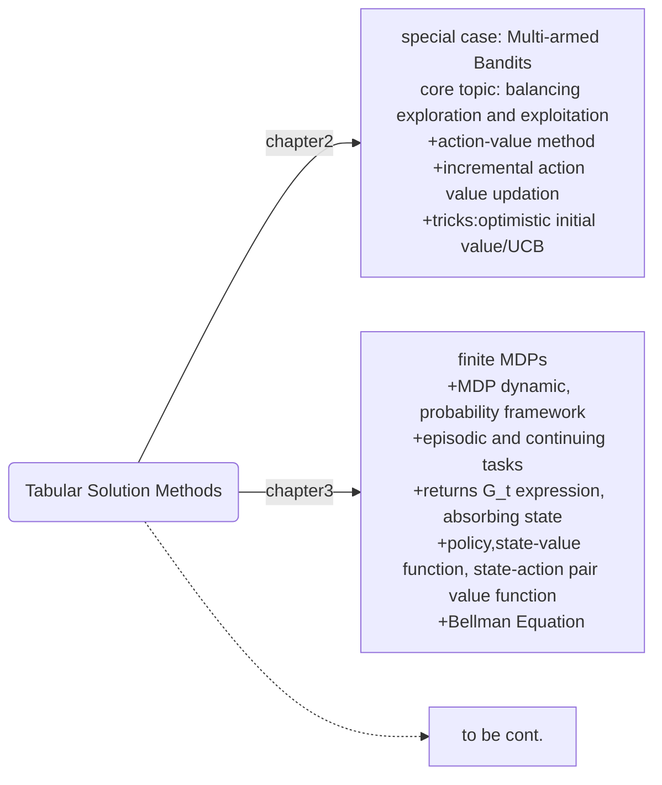

## chapter3 Finite Markov Decision Process

this is the second chapter of part1: Tabular Solution Methods, which makes a theoretical statements of idealized formation of RL. Finite MDPs is associaive, action taken in currenct step whill influence not only immediate reward, but situation in next step and through it, the future rewards as well.

Where are we?

#### 3.1 agent-environment interface
key concepts:
+ $agent$: learner or decision maker
+ $environment$: everything outside the agent. The boundary between agent and environment is usually more closer to the agent. Since reward and state are prompted by the environment, so the state sensation and reward computation are considered as part of environment.
  - agent part: absolute part
  - environment: agent may or may not have knowledge
+ $interaction$: agent selects actions and the environment responding to these actions and presenting new situation to the agent. (push and push back)
The trajectory process like: at every time step, the agent receive some representation of state $S_t\in {\mathcal S}\rightarrow$agent selects action on that basis $A_t\in\mathcal A(s) \stackrel{one\, time\, latter}{\longrightarrow}$receiving a numerical reward $R_{t+1}\in\mathcal R$, and find itself in a new state $S_{t+1}$, display as $S_0,A_0,R_1,S_1,A_1,R_2,S_2,A2,R_3,...$

Finite MDPs means that, the three tuple spaces: $(\mathcal{S, A, R})$ are all finite, this way discrete probability distributions are able to find for $R_t$ and $S_t$, which depend on $S_{t-1}$ and $A_{t-1}$. The shifting dynamic of finite MDP:
$$p(s ^\prime,r|s,a)=Pr\{S_t=s^\prime,R_t=r|S_{t-1}=s,A_{t-1}=a\}\qquad(3.2)$$
The dynamic function $p: \mathcal{S\times R\times S \times A}\rightarrow [0,1]$.

Important assumption: **Markov Property**—— the probability does not depend on all states or actions before time step $t-1$, which means that $S_{t-1}$ has include all information of past needed in future dynamic.

Some probabilities can be derived from equation(3.2):
$$p(s^\prime|s,a)=\sum_{r\in\mathcal R}p(s^\prime,r|s,a)\qquad\qquad(3.4)$$
which is a state-transition equation. And expected reward for state-action pairs
$$r(s,a)=\Bbb E[R_t|S_{t-1}=s,A_{t-1}=a]=\sum_{r\in\mathcal R}r\sum_{s^\prime\in \mathcal S}p(s^\prime,r|s,a)\qquad(3.5)$$
Adding specific state given on basis of preceding one step state-action pairs, expected reward for state-action-next state three tuple:
$$r(s,a,s^\prime)=\sum_{r\in\mathcal R}r\cdot p(r|s,a,s^\prime)=\sum_{r\in\mathcal R}r\cdot \frac{p(s^\prime,r|s,a)}{p(s^\prime|s,a)}\qquad\quad(3.6)$$

#### 3.2 goals and rewards
+ the reward signal is your way of communicating to the robot what you want it to achieve, not how you wnat it achieved.
  - eg. a chess-palyingagent should be rewarded only for actually winning, not for achieving subgoals such as taking opponent's pieces or gaining control of the center of the board. Or it may accomplish this subgoal with cost of losing the game.

#### 3.3 returns and episodes
Here, return is different from reward sequence we receive after each action. The return is the total gain, denoted as $G_t$, which is some specific function of reward sequence. In simpleast format:
$$G_t=R_{t+1}+R_{t+2}+R_{t+3}+\cdot\cdot\cdot+R_T,\qquad\qquad(3.7)$$
+ $T$: final time step, when agent-environment interaction breaks naturally into subsequences, which called $episodes$(repeated).
  - if $T$ is finite, then this task is episodic task
  - else the task is continuing task
+ $S_T$: terminal state, where will be restared to a default standard start of state or a sample from a stat state distribution.
+ $\mathcal S,\mathcal S^+$: $\mathcal S$ is state space excluding terminal states and $\mathcal S^+$ is state space containing terminal states.

For equation(3.7), if $T=\infty$, then $G_t$ is infinite, too.
Add discount factor $\gamma$ to the future rewards when calculated their present value:
$$G_t=R_{t+1}+\gamma R_{t+2}+\gamma^2 R_{t+3}+\cdot\cdot\cdot=\sum_{k=0}^\infty \gamma^kR_{t+k+1}\qquad(3.8)$$
where $0\le\gamma\le1$. Returns($G_t$) has time-series correlation, or its autorelated, since:
$$G_t=R_{t+1}+\gamma(R_{t+2}+\gamma R_{t+3}+\gamma^2+R_{t+4}+\cdot\cdot\cdot)=R_{t+1}+\gamma G_{t+1}\quad(3.9)$$
Also from equation(3.8), we can find:
+ for continuing tasks, when adding a constant to every immediate reward, the relative return of every state won't change; but for episodic task, it's relative to the time step $t$.

#### 3.4 unified notation for epsodic and continuing tasks
$$G_t=\sum_{k=t+1}^T \gamma^{k-t-1}R_k\qquad\qquad(3.11)$$
where $T$ can be infinite and $\gamma$ can be 1. equation(3.11) merge the return format of both episodic and continuing tasks.

#### 3.5 policies and value functions

+ $policy\; \pi$: a mapping from states to probabilities of selecting each possible action.
+ $state-value\,function\,for\,policy\,\pi\;v_\pi(s)$: expected return when starting from state $s$ and following policy $\pi$ afterworth, defined as:
$$v_\pi(s)=\Bbb E_\pi[G_t|S_t=s]=\Bbb E_\pi[\sum_{k=0}^\infty\gamma^kR_{t+k+1}|S_t=s], \rm for\,all\,s\in\mathcal S,\quad(3.12)$$
+ $action-value\,function\,for\,policy\,\pi\;q_\pi(s,a)$: expected return starting from state $s$, taking action a and following policy $\pi$ thereafter, defined as:
$$q_\pi(s,a)=\Bbb E_\pi[G_t|S_t=s,A_t=a]=\Bbb E_\pi[\sum_{k=0}^\infty\gamma^kR_{t+k+1}|S_t=s,A_t=a], \rm for\,all\,s\in\mathcal S.\quad(3.13)$$
+ there are close relationships between $v_\pi(s)$ and $q_\pi(s,a)$:
  rewrite $v_\pi(s)$:
  $$v_\pi(s)=\Bbb E_\pi[R_{t+1}+\gamma G_{t+1}|S_t=s]=\sum_a\pi(a|s)\sum_{s^\prime,r}p(s^\prime,r|s,a)r+\gamma\Bbb E_\pi[G_{t+1}|S_t=s]$$
  And the expected return after time step $t+1$ can be represented as:
  $$\Bbb E_\pi[G_{t+1}|S_t=s]=\sum_{s^\prime}E_\pi[G_{t+1}|S_{t+1}=s^\prime,S_t=s]\cdot p(s^\prime|s)=\sum_{s^\prime}E_\pi[G_{t+1}|S_{t+1}=s^\prime]\cdot p(s^\prime|s)\newline=\sum_{s^\prime}v_\pi(s^\prime)\cdot p(s^\prime|s)=\sum_{s^\prime,r}v_\pi(s^\prime)\cdot p(s^\prime,r|s)=\sum_a\pi(a|s)\sum_{s^\prime,r}v_\pi(s^\prime)\cdot p(s^\prime,r|s,a)$$
  So, $v_\pi(s)=\sum_a\pi(a|s)\sum_{s^\prime,r}p(s^\prime,r|s,a)[r+\gamma v_\pi(s^\prime)]\qquad(3.14)$
  And easy to see $q_\pi(s,a)=\sum_{s^\prime,r}p(s^\prime,r|s,a)[r+\gamma v_\pi(s^\prime)]$, $v_\pi(s)=\sum_a\pi(a|s)q_\pi(s,a)$.

  The state-value function is recursive, stationary with Markov property.

Equation (3.14) is $Bellman\,Equation\,for\,v_\pi$.

#### 3.6 optimal policies and optimal value functions
The ordering of policy can be defined based on state-value function. If $\pi>\pi^\prime$, we mean $v_\pi(s)\ge v_\pi^{\prime}(s)$ for all $s\in\mathcal S$. The optimal policy satisfy:
$$v_*(s)=\max_\pi v_\pi(s),\qquad\qquad(3.15)\newline
q_*(s,a)=\max_\pi q_\pi(s,a)\qquad\qquad(3.16)$$

**Bellman Optimility Equation**
+ Bellman optimility for state-value function:
$$v_*(s)=\max_{a\in\mathcal A(s)} q_*(s,a)\newline=\max_a \Bbb E_{\pi_*}[G_t|S_t=s,A_t=a]\newline
=\max_a \Bbb E_{\pi_*}[R_{t+1}+\gamma G_{t+1}|S_t=s,A_t=a]\newline
=\max_a \Bbb E[R_{t+1}+\gamma v_*(s^\prime)|S_t=s,A_t=a]\quad(3.18)\newline
=\max_a\sum_{s^\prime,r}p(s^\prime,r|s,a)\cdot[r+\gamma v_*(s^\prime)].\qquad(3.19)$$
Equation(3.19) is still recursive format of state-value function, but we use a maximum to replace expectation on action.
+ Bellman optimility for state-action pair value function:
$$q_*(s,a)=\Bbb E[R_{t+1}+\gamma v_*(s^\prime)|S_t=s,A_t=a]\newline
=\Bbb E[R_{t+1}+\gamma \max_{a^\prime\in\mathcal A(s^\prime)}q_*(s^\prime,a^\prime)]\newline
=\sum_{s^\prime,r}p(s^\prime,r|s,a)\cdot[r+\gamma \max_{a^\prime\in\mathcal A(s^\prime)}q_*(s^\prime,a^\prime)]\quad (3.20)$$

The meaning of the existence of $v_*(s)$ is: once we get $v_*(s)$, in every state $s$, we need only one-step ahead search for action $a$ which maximize $q_*(s,a)$. Or we can take greedy action, since $v_*$ has already taken into account the rewards of all possible future behavior.

Ideally we can explicitly solve Bellman Optimility Equation, but the conditions are hard to satisfy in practice:
+ accurately know the dynamics of the environment $p(s^\prime, r|s,a)$
+ enough computational resource
+ Markov Property

which are usually violated, so approximate solution of Bellman Optimality equation is more realistic.
