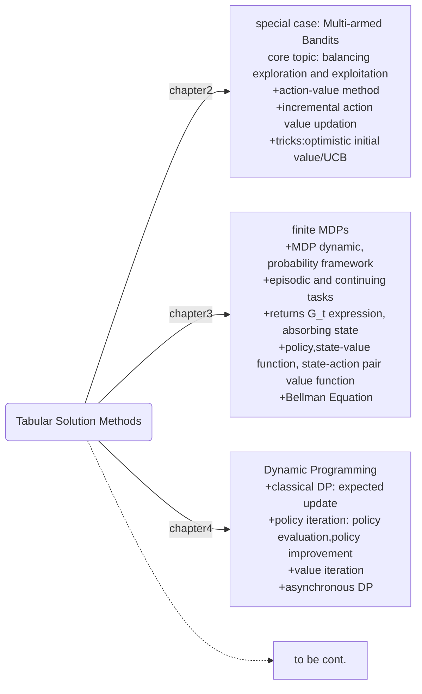

## chapter4 Dynamic Programming

classical DP, to compute optimal policy:
+ assuming a perfect model: $p(s^\prime,r|s,a)$
+ DP is a *boostrapping* method
+ great computational expense

then why bother DP?
+ an essential foundation for the understanding of the methods presented in the rest of the book.
+ how to achieve?
  - target: find optimal policy $\pi(a|s)$
  - method: solve Bellman Optimility Equation by updating rules for improving approximations of the desired value function($v_*(s)$ or $q_*(s,a)$).

where are we?

#### 4.1 policy evaluation(prediction)
recall state-value function under policy $\pi$
$v_\pi(s)=\Bbb E_\pi[R_{t+1}+\gamma v_\pi(s^\prime)|S_t=s]=\sum_a\pi(a|s)\sum_{s^\prime,r}p(s^\prime,r|s,a)[r+\gamma v_\pi(s^\prime)]\qquad(4.4)$.
Also, equation(4.4) can also be written as $v_\pi(s)=\sum_a\pi(a|s)[r(s,a)+\gamma \sum_{s^\prime}p(s^\prime|s,a)v_\pi(s^\prime)]\qquad(4.4^\prime)$.

Under finite MDP framework, $|\mathcal S|$ is finite, so solving $v_\pi$ is to solve $|\mathcal S|$ values in $|\mathcal S|$ equations.

The uniqueness and existence of $v_\pi$ is garanteed by:
+ either $\gamma<1$
+ or for every state under policy \pi, the terminal time step $T<\infty$.

This way, given $\pi(a|s)$(which is known) and assuming environment model $p(s^\prime,r|s,a)$(which is also known), how to get $v_\pi(s)$?
+ we know that equation(4.4) is recursive
+ so we can update the value function $v_k:\mathcal S^+\rightarrow \Bbb R$ iteratively, finally it will converges to $v_\pi$

The updating process can be considered as a sequence of approximate value **function** $v_0,v_1,v_2,...$, we update $v_{k}$ to $v_{k+1}$ by:
$$v_{k+1}(s)=\sum_a\pi(a|s)\sum_{s^\prime,r}p(s^\prime,r|s,a)[r+\gamma v_k(s^\prime)]\qquad(4.5)$$.
Equation(4.5) is *iterative policy evaluation*, when $k\rightarrow\infty$, $v_k\rightarrow v_\pi$.
Every one-step updation(repeat for every state $s\in\mathcal S$) is a *expected update*, because they are based on every possible next state $s^\prime$ rather than a sample next state.

When do coding job, no need to keep as long as $k$ arries, only 2 arries to keep the old values and new values. Or even one array is enough when we use "in-place" updation. We call on complete iteration a *sweep*, and we stop the itertaions when the update is close enough $\max_s|v_{k+1}(s)-v_k(s)|<\theta$.

#### 4.2 policy improvement
in section 4.1, we know how to estimate $v_\pi$. But from policy $\pi$, how to find a better policy? For simplicity, assume policies are all deterministic.

If we follow policy $\pi$, then given current state $s$, we choose action $a=\pi(s)$ and the value of this state-action pair should be $q_\pi(s,a)=\sum_{s^\prime,r}p(s^\prime,r|s,a)[r+\gamma v_\pi(s^\prime)]$.
If instead we just deviate from policy $\pi$ by choosing $a=\pi^\prime(s)$ in current time step but go back to follow policy $\pi$ thereafter. The criteria is:
+ if $v_\pi(s)\le q_\pi(s,\pi^\prime(s))$, although this is just one-time deviation from $\pi$, we will expect a consistent preference when every time $s$ is encountered, $\pi^\prime(s)$ is chosen. The relation states that: $v_\pi(s)\le q_\pi(s,\pi^\prime(s))\le v_{\pi^\prime}(s)$.

The value will then be：
$$q_\pi(s,\pi^\prime(s))=\Bbb E[R_{t+1}+\gamma v_\pi(S_{t+1})|S_t=s]\newline
\le\Bbb E_{\pi^\prime}[R_{t+1}+\gamma q_\pi(S_{t+1},\pi^\prime(S_{t+1}))|S_t=s]\newline=\Bbb E_{\pi^\prime}[R_{t+1}+\gamma \Bbb E_{\pi^\prime}[R_{t+2}+\gamma v_\pi(S_{t+2})|S_{t+1}]|S_t=s]\newline
=\Bbb E_{\pi^\prime}[R_{t+1}+\gamma R_{t+2}+\gamma^2 v_\pi(S_{t+2})|S_t=s]\newline\le
E_{\pi^\prime}[R_{t+1}+\gamma R_{t+2}+\gamma^2 q_\pi(S_{t+2},\pi^\prime(S_{t+2}))|S_t=s]\newline
\le E_{\pi^\prime}[R_{t+1}+\gamma R_{t+2}+\gamma^2 \Bbb E_{\pi^\prime}[R_{t+3}+\gamma v_\pi(S_{t+3})|S_{t+3}]|S_t=s]\newline \cdot\cdot\cdot\newline =v_{\pi^\prime(s)}$$

The policy $\pi^\prime$ in the subscript $\Bbb E_{\pi^\prime}$ represent the one-step action policy is $\pi^\prime$ instead of $\pi$. On contrary, the subscript in $v_\pi$ represents that the policy followed thereafter is still $\pi$.

The policy improving process states that making policy greedy w.r.t value function of the original policy:
$$\pi^\prime(s)={\rm arg \max_a} q_\pi(s,a)
\newline ={\rm arg\max_a}\sum_{s^\prime,r}p(s^\prime,r|s,a)[r+\gamma v_\pi(s^\prime)]\quad(4.9)$$.
repeat it at every state, which is *policy improvement*.

#### 4.3 policy iteration
policy iteration:
$\pi_0\stackrel{E}{\rightarrow}v_{\pi_0}\stackrel{I}{\rightarrow}\pi_1\stackrel{E}{\rightarrow}v_{\pi_1}\stackrel{I}{\rightarrow}\pi_2\cdot\cdot\cdot\stackrel{I}{\rightarrow}\pi_*\stackrel{E}{\rightarrow}v_{\pi_*}$
where $\stackrel{E}{\rightarrow}$ is *policy evaluation* and $\stackrel{I}{\rightarrow}$ is *policy improvement*. The stop condition for *policy evaluation* is $\max_s|v_{k+1}(s)-v_k(s)|<\theta$ and for *policy improvement* $\pi_{k+1}(s)=\pi_k(s)$ for all $s\in\mathcal S$.

Theoretically, the optimal policy convergence is okay for multiple actions are equally optimal, but if checking actual actions, we may switched among those optimal actions and never stop iteration. Modify the policy converge condition: $\pi_{k+1}(s)\in\{a|q_{\pi_k}(s,a)=\max_aq_{\pi_{k}}(s,a)\}$(exercise 4.4).

+ excercise 4.5 policy iteration for $q_*$.
  - step1: initialize $q(s,a)$ and $\pi(s)$ and a $\theta$ parameter.
  - step2: under policy $\pi$, policy evaluation: $q_\pi(s,a)=\sum_{s^\prime,r}p(s^\prime,r|s,a)[r+\gamma\sum_{a^\prime} \pi(a^\prime|s^\prime)q_\pi(s^\prime,a^\prime)]$, until $\theta$ accuracy.
  - step3: policy improvement, $\pi(s)=\rm arg\max_a q_\pi(s,a)$(greedy policy), convergence condition $\pi(s)\in\{a|q_{\pi}(s,a)=\max_aq_{\pi}(s,a)\}$.

+ exercise 4.6 $\varepsilon$-greedy policy iteration for $v_*$.
  - step1: initialize $v(s)$ and $\pi(s)$ and parameter $theta$.
  - step2: since now we don't always choose $a$ that is optimal given $s$, $v_\pi(s)=\sum_{s^\prime,r,a}p(s^\prime,r|s,a)\pi(a|s)[r+\gamma v_\pi(s^\prime)]$
  - step3: $a1=\rm arg\max_a q_\pi(s,a)$, instead of updating $\pi(s)$ to $a1$, we update $\pi(a1|s)=1-\varepsilon+\varepsilon/|\mathcal A(s)|$ and other $\pi(a|s)=\varepsilon/|\mathcal A(s)|$.

#### 4.4 value iteraction
The standard algorithm requires exact convergence in every policy $\pi$ of policy evaluation, but the sweeps can be long and computational. In fact, the convergence of $policy$ is usually in the early stage. So we can just do a few times or even one sweep in every given $\pi$(value evaluation) following updating policy(policy improvement).
$$v_{k+1}(s)=\max_a\Bbb E[R_{t+1}+\gamma v_k(S_{t+1})|S_t=s,A_t=a]\newline=\max_a q_{k+1}(s,a)\newline=\max_a\sum_{s^\prime,r}p(s^\prime,r|s,a)[r+\gamma v_k(s^\prime)]\qquad(4.10)$$

Iteration stops when $\max_s\{|v_{k+1}(s)-v{k}(s)|\}<\theta$.The part in max is value one sweep evaluation, and the max on action is policy improvement. The iteration sequqnces is one sweep for value update and one sweep for policy update.

Although
> Faster convergence is often achieved by interposing multiple policy evaluation sweeps between each policy improvement sweep.

+ exercise 4.10 equation (4.10) for $q_{k+1}(s,a)$:
$$q_{k+1}(s,a)=\Bbb E[R_{t+1}+\gamma \max_{a^\prime} q_k(S_{t+1},a^\prime)|S_t=s,A_t=a]\newline=\sum_{s^\prime,r}p(s^\prime,r|s,a)[r+\gamma \max_{a^\prime} q_k(s^\prime,a^\prime)]$$

#### 4.5 asynchronous dynamic programming(brief)
> + some states may not need their values updated as often as others
> + eg. update the state value in place of only one state $s_k$ on each step $k$, using the value itertaion in equation(4.10), but requiring all states occur in the sequence $\{s_k\}$ an infinite number of times.

#### 4.6~4.8
+ Generalized Policy Iteration(GPI)
  - policy iteration
  - value iteration
  - asynchronous DP
+ DP is comparably efficient than other methods, since it solve Bellman optimility in polynomial time of state space size $n$ and action space size $k$, although the total number of deterministic policies is $k^n$.
+ *boostrapping*: update estimates of values of states based on estimates of values of successor states.
+ DP: model-based and boostrapping method.
