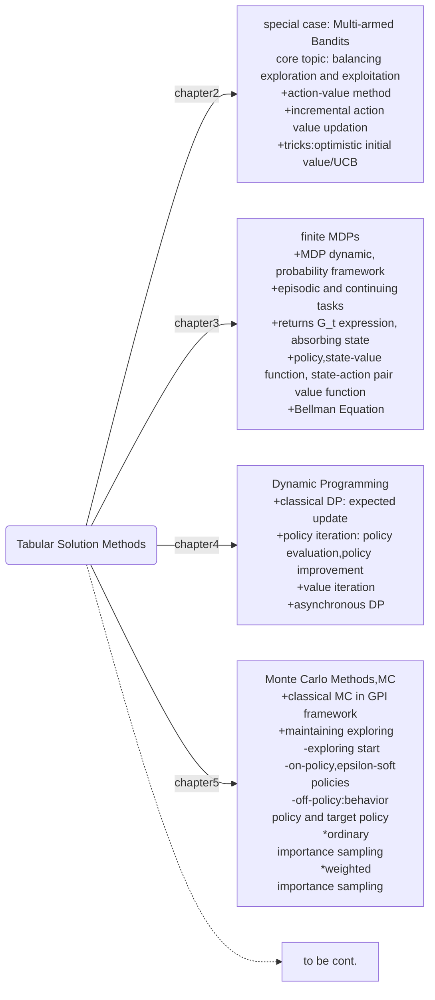

## chapter5 Monte Carlo Methods

- MC is a *learning* method, instead of a $calculation$ method like DP.
- MC is model-free, no boostraping and learning from *experience*: sample sequence of states, actions and rewards from
  + actual interaction with env: no prior knowledge of env is needed and also no model is necessary.
  + simulated interaction with env: a model is required, but only generating transitions samples, not explicit probability distribution.
- on-policy can only converge to optimal in $\varepsilon$-soft policies
- off-policy can converge to optimal policy, but importance sampling is needed to mapping returns from behavior probability space to target probability space.
  + ordinary IS
  + weighted IS

where are we?

#### 5.1 MC prediction
start from estimating $v_\pi(s)$. Back to the definition of $v_\pi(s)$: expected cumulative discounted rewards(return) starting from state $s$.
- we have set of episodes which all pass through state $s$.
  + each occurrence of $s$ is a *visit* to $s$
  + especially, the first occurrence of $s$ in this episode is *first visit* to $s$.
- average returns abserved after visit to $s$:
  + $first visit MC$: average only returns following first visit to $s$
  + $every-visit MC$: average returns following all visit to $s$

algorithm for first visit MC, given policy $\pi$:
> + input policy $\pi$
> + initialize $v_\pi(s)$ for all $s\in\mathcal S$, build an empty list for $r(s)$, every state has a corresponding list.
> + Loop each episodes:
>   - generate an episode following $\pi$: $S_0,A_0,R_1,S_1,A_1,R_2,S_2,A_2,...,R_T,S_T$
>   - $G\leftarrow 0$(for terminal state return, which is always zero)
>   - back iter through time step $t=T-1,T-2,...,0$:
      $G\leftarrow R_{t+1}+\gamma G$
      if $S_t$ not in $S0,S1,S2,...,S_{t-1}$:(no condition for every-visit MC)
          append $G$ to list of $r(S_t)$
          update $v_\pi(S_t)\leftarrow average(r(S_t))$

Advantage of MC:
> the estimates for each state is independent, so it's not boostrapping. Unlike DP, you can just estimate one or a subset of states instead the whole state space.

#### 5.2 MC estimation of action values
For model-free method like MC, $q$ is more useful than $v$, since $v_*$ alone are not enough to give optimal action.

Estimate $q(s,a)$ is basically same with $v(s)$, except here averaging returns following visit of state-action pair.

But one critical problem would hinder our step, some actions won't be taken given state $s$ if we following policy $\pi$. In extreme cases, a deterministic policy will selection only one action given $s$. Then how to *maintaining exploration*?

+ *exploring start*: specifing the episodes starts at a *state-action* pair. But it can't learn from the interaction with env since in the process of this episodes, no other chance it can meet such combination.
+  choosing stochastic policy that gives nonzero probability for every actions in each state.

#### 5.3 MC control
Here, from action value, we can approximate optimal policy $\pi_*$. Extend GPI to MC:
+ classical PI: $\pi_0\stackrel{E}{\rightarrow}q_{\pi_0}\stackrel{I}{\rightarrow}\pi_1\stackrel{E}{\rightarrow}q_{\pi_1}\stackrel{I}{\rightarrow}\pi_2\cdot\cdot\cdot\stackrel{I}{\rightarrow}\pi_*\stackrel{E}{\rightarrow}q_{\pi_*}$ with two assumtions:
  - exploring start(ES)
  - infinite number of episodes in every policy evaluation
+ `MC ES Algorithm`:
> + initialize policy $\pi(s)$ for all $s\in\mathcal S$
> + initialize $q_\pi(s,a)$ for all $s\in\mathcal S$ and $a\in\mathcal A$, build an empty list for $r(s,a)$, every state-action pair has a corresponding list.
> + Loop each episodes:
>    - randomly initialize $S_0,A_0$(exporing start)
>   - generate an episode following $\pi$: $R_1,S_1,A_1,R_2,S_2,A_2,...,R_T,S_T$
>   - $G\leftarrow 0$(for terminal state return, which is always zero)
>   - back iter through time step $t=T-1,T-2,...,0$:
      $G\leftarrow R_{t+1}+\gamma G$
      if $S_t,A_t$ not in $S_0,A_0,S_1,A_1,S_2,A_3,...,S_{t-1},A_{t-1}$:(no condition for every-visit MC ES)
          append $G$ to list of $r(S_t, A_t)$
          update $q_\pi(S_t,A_t)\leftarrow average(r(S_t,A_t))$
          update policy $\pi(S_t)\leftarrow \rm arg\max_a q(S_t,a)$

#### 5.4 MC without exloring starts(on-policy)
*on-policy* control: improve policy that is used to make decison.

The on-policy control methods, the policy is generally *soft*, meaning that $\pi(a|s)>0$ for all $s$ and $a$, but will gradually shift closer to a deterministic optimal policy.

$\varepsilon$-greedy policy is also a $\varepsilon$-$soft$ policy, and it's closest to greedy policy among all $\varepsilon$-soft policies.

$\varepsilon$-soft policies defined for $\pi(a|s)>\frac{\varepsilon}{|\mathcal A(s)|}$.

**on-policy first visit MC control($\varepsilon$-soft policies)**
> + initialize policy $\pi(s)$ for all $s\in\mathcal S$, an $\varepsilon$-soft policy
> + initialize $q_\pi(s,a)$ for all $s\in\mathcal S$ and $a\in\mathcal A$, build an empty list for $r(s,a)$, every state-action pair has a corresponding list.
> + Loop each episodes:
>   - generate an episode following $\pi$: $S_0,A_0,R_1,S_1,A_1,R_2,S_2,A_2,...,R_T,S_T$
>   - $G\leftarrow 0$(for terminal state return, which is always zero)
>   - back iter through time step $t=T-1,T-2,...,0$:
      $G\leftarrow R_{t+1}+\gamma G$
      if $S_t,A_t$ not in $S_0,A_0,S_1,A_1,S_2,A_3,...,S_{t-1},A_{t-1}$:(no condition for every-visit MC ES)
          append $G$ to list of $r(S_t, A_t)$
          update $q_\pi(S_t,A_t)\leftarrow average(r(S_t,A_t))$
          $A^* \leftarrow \rm arg\max_a q(S_t,a)$
          for all $a\in\mathcal A(S_t)$,update policy as:
          $$\pi(a|S_t)=\begin{cases}1-\varepsilon+\frac{\varepsilon}{|\mathcal A(s)|}, & \text{if $a=A*$}\\ \frac{\varepsilon}{|\mathcal A(s)|},& \text{if $a\ne A^* $}\end{cases}$$

Here, we improve a arbitrary $\varepsilon$-soft policy by $\varepsilon$-greedy policy and finally it converges to optimal $\varepsilon$-soft policy.

#### 5.5 off-policy prediction via importance-sampling
Recall on-policy control, we finally converge to $\varepsilon$-soft optimal policy instead of true global optimal policy. We comprimising for continuing exploring. In $\varepsilon$-soft policy, improve policy conditonal on subsequent optimal actions but behave non-optimally($1-\varepsilon$ optimal) for exploring.

Off-policy method uses two policies. One is learned about and improved, as *target policy* and the other is used to generate behavior data(exploring), as *behavior policy*.

**Off** means that learning from data "off" or deviate from target policy. Off-policy learning usually has higher variance and slow convergence, but it's more general, since on-policy is a special case of off-policy learning.

Denote target policy as $\pi$ ans behavior policy as $b$. In order to use $b$ to explore for $\pi$, requiring $b(a|s)>0$ if $\pi(a|s)>0$. Here we want to estimate $q_\pi(s,a)$ or $v_\pi(s)$(which are expected returns following viists) and through them estimate $\pi(s)$, but from samples of $b(s)$.

*Importance Sampling*: estimating expected values of one distribution from samples of another distribution.

If we estimate the expected return(for $q_\pi$ and $v_\pi$) by simply averaging returns from data generated by policy $b$, the result will be $q_{b*}$ and $v_{b_*}$ since probability of every trajectory(episodic sample) is corresponding to policy $b$ instead of policy $\pi$. Or a sample's probabilities in space of policy $\pi$ and $b$ are different. A mapping is needed to transfer the probability(or sample importance) from policy space $b$ to policy space $a$.

For state value function: given state $S_t$, the probability of subsequent state-action trajectory $A_t,S_{t+1},A_{t+1},...,S_{T-1},A_{T-1},S_T$ if following policy $\pi$:
$$Pr\{A_t,S_{t+1},A_{t+1},...,S_T|S_t,A_{t:T-1} \sim \pi\}=\prod_{k=t}^{T(t)-1}\pi(A_k|S_k)\cdot p(S_{k+1}|S_k,A_k)\quad(5.3.1)$$
Similarly for policy $b$:
$$Pr\{A_t,S_{t+1},A_{t+1},...,S_T|S_t,A_{t:T-1} \sim b\}=\prod_{k=t}^{T(t)-1}b(A_k|S_k)\cdot p(S_{k+1}|S_k,A_k)\quad(5.3.2)$$

The mapping ratio or *importance-sampling ratio* is equation(5.3.1)/equation(5.3.2):
$$\rho_{t:T-1}=\prod_{k=t}^{T(t)-1}\frac{\pi(A_k|S_k)}{b(A_k|S_k)}\quad\qquad(5.3.3)$$

An easy way to remember the subscript of IS ratio, is to aware that it aims to actions haven't been taken at the time point $t$.
Although the transition probabilities is unknown, but they re cancelled in the IS ratio. So by multiply IS ratio, we can transfer $v_b(s)=\Bbb E[G_t|S_t=s]$ to $v_\pi(s)=\Bbb E[\rho_{t:T(t)-1}\cdot G_t|S_t=s]$.

For convenience of averaging batch of episodes, let the time step $t$ continues across episodes. $T(t)$ is the nearest terminal state time step after time step $t$. Define $\mathcal T(s)$ the set of all time steps that state $s$ is visited. The estimated state value is:
$$V(s)=\frac{\sum_{t\in\mathcal T(s)}\rho_{t:T(t)}\cdot G_t}{|\mathcal T(s)|}\qquad(5.5)$$

Equation(5.5) is *ordinary importance sampling*, the numerator is sum of returns in transferred to policy $\pi$, and the denominator is the number of samples.

Alternative form is:
$$V(s)=\frac{\sum_{t\in\mathcal T(s)}\rho_{t:T(t)}\cdot G_t}{\sum_{t\in\mathcal T(s)}\rho_{t:T(t)}}\qquad(5.6)$$

Equation(5.6) is *weighted importance sampling*, the weight is relative importance-sampling ratio of each sample.

The estimated action value Q(s,a) is: (excercise 5.6)
$$Q(s,a)=\frac{\sum_{t\in\mathcal T(s,a)}\rho_{t+1:T(t)}\cdot G_t}{|\mathcal T(s,a)|}\qquad(5.5)$$
Here $\mathcal T(s,a)$ is the set of all time steps of the visit in state-action pair $(s,a)$.
Alternative form:
$$Q(s,a)=\frac{\sum_{t\in\mathcal T(s,a)}\rho_{t+1:T(t)}\cdot G_t}{\sum_{t\in\mathcal T(s,a)}\rho_{t+1:T(t)}}\qquad(5.5)$$

Although similar, these two formats have some different properties:(for first-visit MC)
+ ordinary IS is unbiased, but relative large variance, can be extreme.
+ weightes IS is biased, but relative small variance at the early stage of episodes.
+ The error approaches zero for both algorithms, but the weighted importance-sampling method has much lower error at the beginning,
as is typical in practice.

For every-visit MC, both are biased, though the bias falls asymptotically to zero as the number of samples increases.

#### 5.6 incremental implementation
off-policy weighted IS for estimating $Q\rightarrow q_\pi$.
> Input target policy $\pi$.
> Initialize action values $Q(s,a)$
> Initialize sum of past weights, $C(s,a)\leftarrow 1$
> Loop for episodes:
> &emsp;$b\leftarrow$ arbitrary policy with coverage to $\pi$
> &emsp;generate state action sequence following $b$: $S_0,A_0,R_1,S_1,A_1,R_2,...,S_T$
> &emsp;$G\leftarrow 0$
> &emsp;$W\leftarrow 1$(new weight)
> &emsp;Loop through time step $t=T-1,T-2,...,0$:
> &emsp;&emsp;$G\leftarrow G+\gamma R_{t+1}$
> &emsp;&emsp;$C(S_t,A_t)\leftarrow C(S_t,A_t)+W$
> &emsp;&emsp;$Q(S_t,A_t)\leftarrow Q(S_t,A_t)+\frac{W}{C(S_t,A_t)}[G-Q(S_t,A_t)]$
> &emsp;&emsp;$W\leftarrow W\frac{\pi(A_t|S_t)}{b(A_t|S_t)}$(if estimating $v_\pi$, update $W$ before $C$ and $Q$)

#### off-policy MC control
Here estimate optimal policy, let's say the target policy is deterministic, and behavior policy is $\varepsilon$-soft policy for exploring.

off-policy MC control, weighted IS, for estimating $\pi\approx \pi_*$
> Initialize action values $Q(s,a)$
> Initialize sum of past weights, $C(s,a)\leftarrow 1$
> Initialize target policy $\pi(s)\leftarrow \rm arg\max_a Q(s,a)$.
> Loop for episodes:
> &emsp;$b\leftarrow$ arbitrary $\varepsilon$-soft policy with coverage to $\pi$
> &emsp;generate state action sequence following $b$: $S_0,A_0,R_1,S_1,A_1,R_2,...,S_T$
> &emsp;$G\leftarrow 0$
> &emsp;$W\leftarrow 1$(new weight)
> &emsp;Loop through time step $t=T-1,T-2,...,0$:
> &emsp;&emsp;$G\leftarrow G+\gamma R_{t+1}$
> &emsp;&emsp;$C(S_t,A_t)\leftarrow C(S_t,A_t)+W$
> &emsp;&emsp;$Q(S_t,A_t)\leftarrow Q(S_t,A_t)+\frac{W}{C(S_t,A_t)}[G-Q(S_t,A_t)]$
> &emsp;&emsp;$\pi(S_t)\leftarrow\rm arg \max_a Q(S_t,A_t)$
> &emsp;&emsp;if $A_t\ne\pi(S_t)$, breek inner loop and turn to next episodes(since all weights after will be zero and no update for $Q$; a non-optimal action won't be in the trajectory in policy space $\pi$)
> &emsp;&emsp;$W\leftarrow W\frac{1}{b(A_t|S_t)}$(if estimating $v_\pi$, update $W$ before $C$ and $Q$)

A drawbakck is: if nonoptimal actions are common, then the learning can be greatly slow, especially for states in the early portion of the long episodes(explained in the if condition which will break the inner loop due to nonoptimal actions are encountered).

#### 5.8* discounting-aware IS
complicated and hard to code, I prefer the next method is better!

#### 5.9* pre-decision IS
$$\rho_{t:T-1}G_t=\rho_{t:T-1}[R_{t+1}+\gamma R_{t+2}+\cdot\cdot\cdot +\gamma^{T-t-1} R^T]\newline
=\rho_{t:T-1}R_{t+1}+\gamma \rho_{t:T-1}R_{t+2}+\cdot\cdot\cdot+\gamma^{T-t-1} \rho_{t:T-1}R^T\quad(5.11)$$

Since expected rewards in equation(5.11) is relevent only with state and action in time $t$ but not the state or action following, so $\Bbb E[\rho_{t:T-1}R_{t+1}]=\Bbb E[\rho_{t:t}R_{t+1}]$. And so:
$$\Bbb E[\rho_{t:T-1}G_t]=\Bbb E[\tilde{G_t}]\newline
\tilde{G_t}=\rho_{t:t}R_{t+1}+\rho_{t:t+1}R_{t+2}+\cdot\cdot\cdot+\rho_{t:T-1}R_T$$

This is *per-decision* IS, the IS ratio is applied in each immediate reward which matching with their trajectory from $t$. And using ordinary IS, the unbiased estimate of state value is:
$$V(s)=\frac{\sum_{t\in\mathcal T(s)}\tilde{G_t}}{|\mathcal T(s)|}$$
