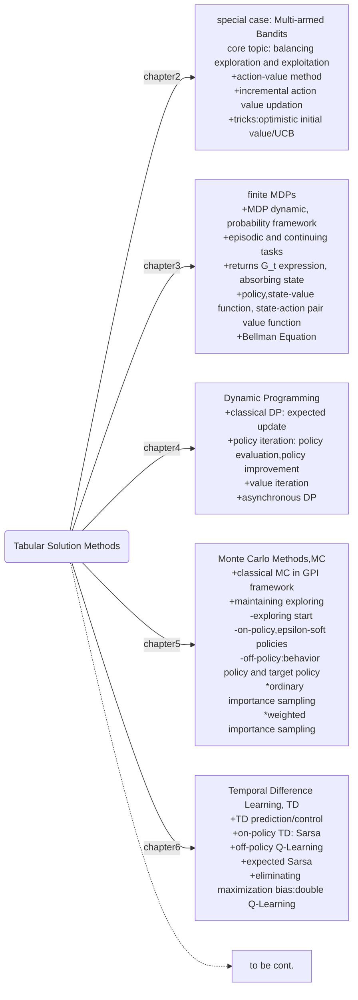

## chapter6 Temporal Difference Learning

+ introduce one-step, tabular model-free TD
+ TD is combination of DP and MC, which learns from experience and update estimates based on other learned estimates without waiting for a final outcome(episodes).
+ policy evaluation(prediction problem) contains main differences among DP, MC and TD; while policy improvement(control problem) uses GPI framework.

where are we?

#### 6.1 TD prediction
For *constant-$\alpha$* MC, estimates update follow a target-error pattern:
$$V(s)=V(s)+\alpha[G_t-V(s)]\qquad\quad(6.1)$$
The target is $G_t$ which we don't know until teminal state in episode.

Recall Bellman equation in chapter3, $\Bbb E[G_t|S_t=s]=\Bbb E[R_{t+1}+\gamma v(s^\prime)|S_t]\quad(6.4)$. when relace $G_t$ with immediate reward and estimate of one-step state value:
$$V(s)=V(s)+\alpha[R_{t+1}+\gamma V(S_{t+1})-V(s)]\qquad\quad(6.2)$$

Equation is TD(0) or one-step TD, which is a special case of TD($\lambda$)(chapter 12) or n-step TD(chapter 7). The error in bracket of equation(6.2) is TD error $\delta_t$ at time $t$, or error in $V(S_t)$ but available at time $t+1$.

Note that, MC is episode-by-episode update for value function(state value $V(s)$ won't change during single episode). If that's true for TD, we can show that MC error(update at the episode terminal state) is the sum of TD erros:
$$
G_t-V(S_t)=R_{t+1}+\gamma G_{t+1}-V(S_t)+\gamma V(S_{t+1})-\gamma V(S_{t+1})\newline
=\delta_t+\gamma [G_{t+1}-V(S_{t+1})]\\
=\delta_t+\gamma\delta_{t+1}+\gamma^2 [G_{t+2}-V(S_{t+2})])\\
=\delta_t+\gamma \delta_{t+1}+\cdot\cdot\cdot+\gamma^{T-t-1}\delta_{T-1}+\gamma^{T-t}(0-0)\\
=\sum_{k=t}^{T-1}\gamma^{k-t}\delta_k\qquad\qquad(6.6)
$$

#### 6.2 advantages of TD prediction method
+ naturally in on-line and inremental fashion
+ can learn from each transition regardless of what subsequent actions are taken(MC ignores exploring action)
+ TD convergence ($V(s)\rightarrow v_\pi(s)$):
  - if constsnt $\alpha$ is used, then the mean of for a constant $\alpha$ if it's sufficient samll
  - or $\alpha$ decreases according to the usual stochastic approximation conditions(recall section 2.7)

Exercise 6.4: smaller $alpha$ leads to better estimate for both TD and MC.

#### 6.3 optimality of TD(0)
**batch TD(0)**: we have a finite amount of experience(samples), let's treat them as training data or a batch. for every sample(or time step), the TD error or increment is calculated as equation (6.2); instead of update value function $V$ with single increment, we update only once in a iteration by the sum of all increments.

Under batch TD(0), the convergence is different from constant $\alpha$ MC. When sample size is not large enough, especially biased, we can observe that batch TD(0) performs better than constant $\alpha$ MC. But why?

See an example:
A *Markov Reward Process*(MRP, ignore policy and treat action taken by agent is no difference with env), 8 episoes are observed as follow: $A,0,B,0;\quad B,1;\quad B,1;\quad B,1;\quad B,1;\quad B,1;\quad B,1;\quad B,0$ .
Not hard to tell the value of $B$ is $\frac{3}{4}$ , because 6 out of 8 have return of 1. But what's $V(A)$?
- MC: $V(A)=0$ since only one episode contains state $A$ and the average return is 0.
- batch TD(0): $V(A)=0+V(B)=\frac{3}{4}$, if $\gamma=1$.

Why is the difference? Which estimate is better?
+ MC depends only on samples and no boostrapping, TD is boostrapping
+ the sample size is small and state $A$ is so rare, which may contain biases
+ MC minimize mean-squared error on training set
+ batch TD(0) finds answer under maximum-likelihood model of Markov process, or Markov process' MLE. Batch TD(0) assumes a model $p(s^\prime,r|s)$ and estimate the model parameter with the empirical data which will maximize the probability that generate the data. So $\hat{p}(B|A)=1$ and $r(B,A)=0$. Batch TD(0) converges to *certainty-equivalence estimate*(assume the underlying process is known: with MLE to replece it)
+ except batch TD(0) converges to true certainty-quivalence estimate, it can achieve it in $O(n)$ computation time!

#### 6.4 sarsa on-policy TD control
For model-free control problem, action value $q_\pi(s,a)$ is needed to make action choice.
$$Q(S_t,A_t)\leftarrow Q(S_t,A_t)+\alpha[R_{t+1}+\gamma Q(S_{t+1},A_{t+1})-Q(S_t,A_t)]\qquad(6.7)$$
Equation (6.7) uses a quintuple event $(S_t,A_t,R_{t+1},S_{t+1},A_{t+1})$, which lead to the algorithm name s.a.r.s.a. The convergence to optimal is garanteed when (on-policy here) $\varepsilon$-soft polices are used, all states-action pairs are visited infinite times and policy converge in the limit to greedy policy.(eg. by setting $\varepsilon=\frac{1}{t}$)

Sarsa(on-policy TD control) for estimating $Q\approx q_*$
> + input parameter $\gamma$ and $\varepsilon$
> + Initialize $\varepsilon$-soft policy $\pi$, $Q(s,a)$ arbitrarily except $Q(terminal,.)=0$.
> + Loop each episodes:
> &emsp; Initialize state $S$
> &emsp; choose action $A$ using $\pi$
> &emsp; Loop each time step:
> &emsp;&emsp; take action $A$;
> &emsp;&emsp; get reward $R$;
> &emsp;&emsp; shift to new state $S^\prime$;
> &emsp;&emsp; choose action $A^\prime$ following $\pi$;
> &emsp;&emsp; update $Q(S,A)\leftarrow Q(S,A)+\alpha[R+\gamma Q(S^\prime,A^\prime)-Q(S,A)]$
> &emsp;&emsp; $S\leftarrow S^\prime, A \leftarrow A^\prime$
> &emsp;&emsp; if $S$ is terminal state, exit

#### 6.5 Q-learning: off-policy TD control
Off-policy TD:
$$Q(S_t,A_t)\leftarrow Q(S_t,A_t)+\alpha[R_{t+1}+\gamma \max_a Q(S_{t+1},a)-Q(S_t,A_t)]\quad(6.8)$$

Different from equation (6.7), $A_{t+1}$ does not need to be selected following policy $\pi$ when updating $Q$.
It just assums that the deviation from optimal action of $S_t$ may just happend once by a exploring action $A_t$, after that it will still follow current optimal action(since optimal value from $S_{t+1}$).

Q-Learning(off-policy TD control) for estimating $\pi\approx \pi^* $
> + input parameter $\gamma$ and $\varepsilon$
> + Initialize $\varepsilon$-soft policy $\pi$, $Q(s,a)$ arbitrarily except $Q(terminal,.)=0$.
> + Loop each episodes:
> &emsp; Initialize state $S$
> &emsp; Loop each time step:
> &emsp;&emsp; choose action $A$ using $\pi$
> &emsp;&emsp; take action $A$;
> &emsp;&emsp; get reward $R$;
> &emsp;&emsp; shift to new state $S^\prime$;
> &emsp;&emsp; update $Q(S,A)\leftarrow Q(S,A)+\alpha[R+\gamma \max_a Q(S^\prime,a)-Q(S,A)]$
> &emsp;&emsp; $S\leftarrow S^\prime$
> &emsp;&emsp; if $S$ is terminal state, exit

Note that Q-Learning learns optimal policy een following non-greedy policy, while Sarsa learns suboptimal policy if $\varepsilon$-soft policy does not conerge to greedy policy.

#### 6.6 expected Sarsa
Refer Sarsa, we select $A_{t+1}$ from $S_{t+1}$ following $\pi$, and update partially with $Q(S_{t+1},A_{t+1})$. This can cause great variance due to random action selection. What if instead update with a single action sample we update it with the expected action selection value according to the $\pi$ probability.
$$Q(S_t,A_t)\leftarrow Q(S_t,A_t)+\alpha[R_{t+1}+\gamma \Bbb E_\pi [Q(S_{t+1},A_{t+1})|S_{t+1}]-Q(S_t,A_t)]\\
\leftarrow  Q(S_t,A_t)+\alpha[R_{t+1}+\gamma \sum_a \pi(a|S_{t+1})\cdot Q(S_{t+1},a)-Q(S_t,A_t)]\quad(6.9)$$

This algorithm is more close to Q-Learning, but in expectation it's like Sarsa, so we call it *Expected Sarsa*.

*Expected Sarsa* can be on-policy($\varepsilon$-soft) or off-policy($b$ is $\varepsilon$-soft and $\pi$ is greedy, then exactly Q-Learning, or Q-Learning is a special case of expected Sarsa).

Note that large $\alpha$ can help algorithms(Sarsa, Q-Learning and expected Sarsa) perform better in early stage of training, but will usually damage the asymptotical performance after a large number of iterations. Expected Sarsa' asymptotical performance does not suffer from Sarsa.

#### 6.7 maximization bias and double learning
*Maximization bias* rises up when we estimate the value of a maximization while the maximization of estimates who come from the sample dataset. Typically, we use the same samples to get estimates of action values $Q(S,a)$, and then select the optimal action $a^* $(maximization over action values) and estimate the value of optimal action just using $Q(S,a^*) $. This will cause our estimate of $Q(S,a^*)$ is usually larger(positive bias) than its true value.

Here consider a state $S$, from $S$ there are many actions can be selected, and the reward of these state-action pairs are a norml distribution with mean of 0 and variance of 1. Then, we know those actions are equivalent and the value of state $S$ is 0 in expectation. But due to maximization bias, we are easy to observe $\max_a Q(S,a)>0$, and would like to choose $S$ more frequently.

How to eliminate maximization bias?
The problem is the estimate of $Q(S,A^*)$ is not independent from selection of $A^*$. If we make a mistake by choosing $A^*$ as the true optimal $a^*$, we should check our choice in another dataset——if $A^*$ is not true optimal action, it shall hard to see its value highest in both datasets.

The idea is dividing samples into 2 sets, and use them to learn 2 independent estimates $Q_1(a)$ and $Q_2(a)$. In turn, we use one estimate, say $Q_1$ to determine the maximizing action $A^*=\rm arg \max_a Q_1(a)$, other $Q_2$ to give the estimate of $A^*$'s value $Q_2(A^*)=Q_2(\rm arg \max_a Q_1(a))$, which is unbiased due to $\Bbb E[Q_2(A^*)]=q(A^*)$.

If apply double Q-Learning:
by flipping a coin:
if head:
$$Q_1(S_t,A_t)\leftarrow Q_1(S_t,A_t)+\alpha[R_{t+1}+\gamma Q_2(S_{t+1},\rm arg \max_a Q_1(S_{t+1},a))-Q_1(S_t,A_t)]\quad(6.10.1)$$
else:
$$Q_2(S_t,A_t)\leftarrow Q_2(S_t,A_t)+\alpha[R_{t+1}+\gamma Q_1(S_{t+1},\rm arg \max_a Q_2(S_{t+1},a))-Q_2(S_t,A_t)]\quad(6.10.2)$$
And the policy can be based on these two estimates by averaging or summing them. Since estimate on each sample does not increase, so same computational cost on each step but double memory spaces needed.

Double Q-Learning for estimating $Q_1\approx Q_2 \approx q^*$
> + input parameter $\gamma$ and $\varepsilon$
> + Initialize $\varepsilon$-soft policy $\pi$, $Q_1(s,a)$  and $Q_2(s,a)$ arbitrarily except $Q(terminal,.)=0$.
> + Loop each episodes:
> &emsp; Initialize state $S$
> &emsp; Loop each time step:
> &emsp;&emsp; choose action $A$ using $\pi$ from $Q_1+Q_2$
> &emsp;&emsp; take action $A$;
> &emsp;&emsp; get reward $R$;
> &emsp;&emsp; shift to new state $S^\prime$;
> &emsp;&emsp; with 0.5 probability:
> &emsp;&emsp;&emsp; update $Q_1(S,A)\leftarrow Q_1(S,A)+\alpha[R+\gamma Q_2(S^\prime,\rm arg\max_a Q_1(S^\prime,a))-Q_1(S,A)]$
> &emsp;&emsp; else:
> &emsp;&emsp;&emsp; update $Q_2(S,A)\leftarrow Q_2(S,A)+\alpha[R+\gamma Q_1(S^\prime,\rm arg\max_a Q_2(S^\prime,a))-Q_2(S,A)]$
> &emsp;&emsp; $S\leftarrow S^\prime$
> &emsp;&emsp; if $S$ is terminal state, exit

Similarily, double expected Sarsa for  estimating $Q_1\approx Q_2 \approx q^*$(excercise 6.13)
> + input parameter $\gamma$ and $\varepsilon$
> + Initialize $\varepsilon$-soft policy $\pi$, $Q_1(s,a)$  and $Q_2(s,a)$ arbitrarily except $Q(terminal,.)=0$.
> + Loop each episodes:
> &emsp; Initialize state $S$
> &emsp; Loop each time step:
> &emsp;&emsp; choose action $A$ using $\pi$ from $Q_1+Q_2$
> &emsp;&emsp; take action $A$;
> &emsp;&emsp; get reward $R$;
> &emsp;&emsp; shift to new state $S^\prime$;
> &emsp;&emsp; with 0.5 probability:
> &emsp;&emsp;&emsp; update $Q_1(S,A)\leftarrow Q_1(S,A)+\alpha[R+\gamma \sum_a \pi(a|S^\prime)Q_2(S^\prime,a)-Q_1(S,A)]$
> &emsp;&emsp; else:
> &emsp;&emsp;&emsp; update $Q_2(S,A)\leftarrow Q_2(S,A)+\alpha[R+\gamma Q_1(S^\prime,\sum_a \pi(a|S^\prime)Q_1(S^\prime,a)-Q_2(S,A)]$
> &emsp;&emsp; $S\leftarrow S^\prime$
> &emsp;&emsp; if $S$ is terminal state, exit

#### 6.8 games, afterstates, and other special cases
*afterstates*: if given a state-action pair $(S,A)$, we completely know what immediate situation will be after action $A$ is taken given current state $S$(we say we have initial knowledge about the env), the immediate situation is an afterstate. If though $(S_1,A_1)$ is different from $(S_1,A_2)$, but they are leading to the same afterstate, and if these situations are common(ususlly symmetricity or equivalence exists), instead of estimating $(S,A)$, we can directly assess afterstates' value(which is more efficient and accurate, since the number of afterstate is smaller and it garantee state-action pairs who have same afterstates have same value). E.g. tic-tac-toe.

Afterstate combined with policy can also be fitted into GPI framework.
