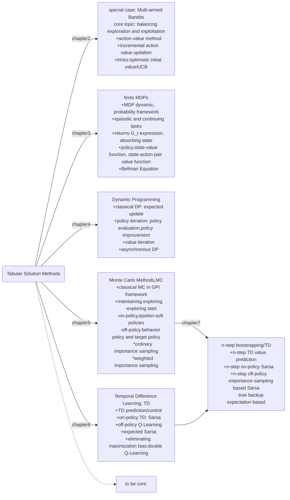

## chapter7 n-step boostrapping

+ present *n-step TD*: enables boostrapping to occur over multiple steps
+ *n-step TD* combines MC and ons-step TD in chapter6

where are we?

#### 7.1 n-step TD prediction
Again, the true returns is:
$$G_t=R_{t+1}+\gamma R_{t+2}+\cdot\cdot\cdot+\gamma R_T$$
MC update $V(S_t)$ until time $T$ with the true sample $G_t$. Instead n-step TD estimate $G_t$ with n-step true rewards and truncated rewards after $R_{t+n}$, corect the rest rewards with value of $S_{t+n}$ at time step $t+n-1$:
$$G_{t:t+n}=R_{t+1}+\gamma R_{t+2}+\cdot\cdot\cdot+\gamma^{n-1} R_{t+n}+\gamma^n V_{t+n-1}(S_{t+n})\quad(7.1)\newline G_{t:t+n}=G_t\;if\; t+n>T$$
The updatio of state value function:
$$V_{t+n}(S_t)=V_{t+n-1}(S_t)+\alpha[G_{t:t+n}-V_{t+n-1}(S_t)]\qquad(7.2)$$
value updation of state in time $t$ $S_t$ is not available until time $t+n$; for $s\ne S_t$, $V_{n+t}(s)=V_{n+t-1}(s)$.

n-step TD for estimating $V\approx v_\pi$
> input a policy $\pi$
> input parameters: $\alpha$ and step number $n$
> initialize value function $V(S)$ for all $S\in \mathcal S$
> Loop over episodes:
> &emsp; initialize and store $S_0\ne terminal$
> &emsp; $T\leftarrow \infty$
> &emsp; Loop for $t=0,1,2,...$:
> &emsp;&emsp; if $t<T$, then:
> &emsp;&emsp;&emsp; take action according to $\pi(S_t)$
> &emsp;&emsp;&emsp; receive $R_{t+1}$ and next state $S_{t+1}$ and store them
> &emsp;&emsp; $\tau\leftarrow t-n+1$(number counting)
> &emsp;&emsp; if $\tau\ge 0$:
> &emsp;&emsp;&emsp; $G\leftarrow \sum_{i=\tau+1}^{\min(\tau+n,T)}R_{i}$
> &emsp;&emsp;&emsp; if $\tau+n<T$:
> &emsp;&emsp;&emsp;&emsp; $G\leftarrow G+\gamma^n V_{t+n-1}(S_{\tau+n})$
> &emsp;&emsp;&emsp; update value function: $V(S_\tau)\leftarrow V(S_\tau)+\alpha[G-V(S_\tau)]$
> &emsp;&emsp; until $\tau=T-1$

*error reduction property* of n-step returns:
$$\max_s |\Bbb E_\pi[G_{t:t+n}|S_t=s]|\le \gamma^n \max_s |V_{t+n-1}(s)-v_\pi(s)|\qquad (7.3)$$

#### 7.2 n-step Sarsa
n-step Sarsa control problem, first extend state value prediction to action value function.
$$Q_{t+n}(S_t,A_t)=Q_{t+n-1}(S_t,A_t)+\alpha[G_{t:t+n}-Q_{t+n-1}(S_t,A_t)]\quad(7.5)\newline G_{t:t+n}=R_{t+1}+\gamma R_{t+1}+\cdot\cdot\cdot+\gamma^{n-1}R_{t+n}+\gamma^n Q_{t+n-1}(S_{t+n},A_{t+n}),n\ge1,0\le t\le T-n\quad(7.4)$$

n-step Sarsa for estimating $Q\approx q^*, \pi\approx\pi^*$
> initialize a $\varepsilon$-soft policy $\pi$
> input parameters: $\alpha$ and step number $n$
> initialize value function $Q(S,A)$ for all $S\in \mathcal S$ and all $A\in\mathcal A$
> Loop over episodes:
> &emsp; initialize and store $S_0\ne terminal$
> &emsp; select and store action $A_0$ based on $\pi(\cdot|S_0)$
> &emsp; $T\leftarrow \infty$
> &emsp; Loop for $t=0,1,2,...$:
> &emsp;&emsp; if $t<T$, then:
> &emsp;&emsp;&emsp; take action $A_t$
> &emsp;&emsp;&emsp; receive $R_{t+1}$ and next state $S_{t+1}$ and store them
> &emsp;&emsp;&emsp; if $t<T-1$, then:
> &emsp;&emsp;&emsp;&emsp; select and store $A_{t+1}$ based on $\pi(\cdot|S_{t+1})$
> &emsp;&emsp;&emsp; else: $T\leftarrow t+1$
> &emsp;&emsp; $\tau\leftarrow t-n+1$(number counting)
> &emsp;&emsp; if $\tau\ge 0$:
> &emsp;&emsp;&emsp; $G\leftarrow \sum_{i=\tau+1}^{\min(\tau+n,T)}R_{i}$
> &emsp;&emsp;&emsp; if $\tau+n<T$:
> &emsp;&emsp;&emsp;&emsp; $G\leftarrow G+\gamma^n Q_{t+n-1}(S_{\tau+n}, A_{\tau+n})$
> &emsp;&emsp;&emsp; update action value function: $Q(S_\tau, A_\tau)\leftarrow Q(S_\tau, A_\tau)+\alpha[G-Q(S_\tau,A_\tau)]$
> &emsp;&emsp; until $\tau=T-1$

(Exercise 7.4) $$G_{t:t+n}=Q_{t-1}(S_t,A_t)+\sum_{k=t}^{\min(t+n,T)-1}\gamma^{k-t}[R_{k+1}+\gamma Q_{k}(S_{k+1},A_{k+1})-Q_{k-1}(S_k,A_k)]\quad(7.6)$$

For expected Sarsa, estimated return modified as:
$$G_{t:t+n}=R_{t+1}+\gamma R_{t+1}+\cdot\cdot\cdot+\gamma^{n-1}R_{t+n}+\gamma^n\sum_a \pi(a|S_{t+n})\cdot Q_{t+n-1}(S_{t+n},A_{t+n})\quad(7.7)$$

#### 7.3 n-step off-policy learning
Modify equation(7.2) a little by adding IS ratio for actions:
$$V_{t+n}(S_t)=V_{t+n-1}(S_t)+\alpha\rho_{t:t+n-1}[G_{t:t+n}-V_{t+n-1}(S_t)]\qquad(7.9)\newline
\rho_{t:h}=\prod_{k=t}^{\min(h,T-1)}\frac{\pi(A_k|S_k)}{b(A_k|S_k)}\qquad\qquad(7.10)$$
Extend the value updation to action values:
$$Q_{t+n}(S_t,A_t)=Q_{t+n-1}(S_t,A_t)+\alpha\rho_{t+1:t+n}[G_{t:t+n}-Q_{t+n-1}(S_t,A_t)]\quad(7.11)$$
For expected Sarsa:
$$Q_{t+n}(S_t,A_t)=Q_{t+n-1}(S_t,A_t)+\alpha\rho_{t+1:t+n-1}[G_{t:t+n}-\sum_a \pi(a|S_t)Q_{t+n-1}(S_t,a)]\quad(7.11)$$

off-policy n-step Sarsa for estimating $Q\approx q_*$
> input bahavior policy $b$, with coverage of all states, like a $\varepsilon$-soft policy
> input parameters: $\alpha$ and step number $n$
> let target policy $\pi$ be greedy to $Q$
> initialize value function $Q(S,A)$ for all $S\in \mathcal S$ and all $A\in\mathcal A$
> Loop over episodes:
> &emsp; initialize and store $S_0\ne terminal$
> &emsp; select and store action $A_0\sim b(\cdot|S_0)$
> &emsp; $T\leftarrow \infty$
> &emsp; Loop for $t=0,1,2,...$:
> &emsp;&emsp; if $t<T$, then:
> &emsp;&emsp;&emsp; take action $A_t$
> &emsp;&emsp;&emsp; receive $R_{t+1}$ and next state $S_{t+1}$ and store them
> &emsp;&emsp;&emsp; if $t<T-1$, then:
> &emsp;&emsp;&emsp;&emsp; select and store $A_{t+1}\sim b(\cdot|S_{t+1})$
> &emsp;&emsp;&emsp; else: $T\leftarrow t+1$
> &emsp;&emsp; $\tau\leftarrow t-n+1$(number counting)
> &emsp;&emsp; if $\tau\ge 0$:
> &emsp;&emsp;&emsp; $G\leftarrow \sum_{i=\tau+1}^{\min(\tau+n,T)}R_{i}$
> &emsp;&emsp;&emsp; if $\tau+n<T$:
> &emsp;&emsp;&emsp;&emsp; $\rho\leftarrow \prod_{k=\tau+1}^{\min(\tau+n,T)-1}\frac{\pi(A_k|S_k)}{b(A_k|S_k)}$
> &emsp;&emsp;&emsp;&emsp; $G\leftarrow G+\gamma^n Q_{t+n-1}(S_{\tau+n}, A_{\tau+n})$
> &emsp;&emsp;&emsp; update action value function: $Q(S_\tau, A_\tau)\leftarrow Q(S_\tau, A_\tau)+\alpha\rho[G-Q(S_\tau,A_\tau)]$
> &emsp;&emsp; until $\tau=T-1$

(Exercise 7.4) $$G_{t:t+n}=Q_{t-1}(S_t,A_t)+\sum_{k=t}^{\min(t+n,T)-1}\gamma^{k-t}[R_{k+1}+\gamma Q_{k}(S_{k+1},A_{k+1})-Q_{k-1}(S_k,A_k)]\quad(7.6)$$

#### 7.4 *per-decision methods with control variates
pass

#### 7.5 off-policy learning without IS: the n-step tree backup algorithm
Although this algorithm is off-policy, but it takes action probabilities in target policy by expectation instead of IS ratios.
It's convinenient to calculate target return of this method **backup**:
+ for last state:
$$G_{t:t+1}=R_{t+1}+\gamma \sum_a \pi(a|S_{t+1})Q_{t}(S_{t+1},a)\qquad(7.15)$$
+ for last 2 steps:
$$G_{t:t+2}=R_{t+1}+\gamma \sum_{a\ne A_{t+1}} \pi(a|S_{t+1})Q_{t+1}(S_{t+1},a)+\gamma\pi(A_{t+1}|S_{t+1})[R_{t+2}+\gamma \sum_a \pi(a|S_{t+2})Q_{t+1}(S_{t+2},a)]\newline
=R_{t+1}+\gamma \sum_{a\ne A_{t+1}} \pi(a|S_{t+1})Q_{t+1}(S_{t+1},a)+\gamma\pi(A_{t+1}|S_{t+1})G_{t+1:t+2}$$
+ recursively, $t<T-1,n\ge 2$:
$$G_{t:t+n}=R_{t+1}+\gamma \sum_{a\ne A_{t+1}} \pi(a|S_{t+1})Q_{t+n-1}(S_{t+1},a)+\gamma\pi(A_{t+1}|S_{t+1})G_{t+1:t+n}\quad(7.16)$$

Exercise(7.11) if $Q$ is unchanging, equation(7.16) is a sum of expectation-based TD errors:
$$G_{t:t+n}=Q(S_t,A_t)+\sum_{k=t}^{\min(t+n,T)-1}\delta_k \prod_{i=t+1}^{k}\gamma\pi(A_i|S_i)\\
\delta_k=R_{k+1}+\gamma \sum_a \pi(a|S_{k+1})Q(S_{k+1},a)-Q(S_k,A_k)$$

n-step tree backup for estimating $Q\approx q_*$
> input bahavior policy $b$, with coverage of all states
> input parameters: $\alpha$ and step number $n$
> let target policy $\pi$ be greedy to $Q$
> initialize value function $Q(S,A)$ for all $S\in \mathcal S$ and all $A\in\mathcal A$, the store of all $S,A,R$ can take mod of $n+1$
> Loop over episodes:
> &emsp; initialize and store $S_0\ne terminal$
> &emsp; select and store action $A_0\sim b(\cdot|S_0)$
> &emsp; $T\leftarrow \infty$
> &emsp; Loop for $t=0,1,2,...$:
> &emsp;&emsp; if $t<T$, then:
> &emsp;&emsp;&emsp; take action $A_t$
> &emsp;&emsp;&emsp; receive $R_{t+1}$ and next state $S_{t+1}$ and store them
> &emsp;&emsp;&emsp; if $t<T-1$, then:
> &emsp;&emsp;&emsp;&emsp; select and store $A_{t+1}\sim b(\cdot|S_{t+1})$
> &emsp;&emsp;&emsp; else: $T\leftarrow t+1$
> &emsp;&emsp; $\tau\leftarrow t-n+1$(number counting)
> &emsp;&emsp; if $\tau\ge 0$:
> &emsp;&emsp;&emsp; if $t+1>T$:
> &emsp;&emsp;&emsp;&emsp; $G\leftarrow R_T$
> &emsp;&emsp;&emsp; else:
> &emsp;&emsp;&emsp;&emsp; $G\leftarrow R_{t+1}+\gamma \sum_a \pi(a|S_{t+1})Q(S_{t+1},a)$
> &emsp;&emsp;&emsp; Loop from $k=\min(t,T-1)$ to $\tau+1$:
> &emsp;&emsp;&emsp;&emsp;$G\leftarrow R_k+\gamma \sum_{a\ne A_{k}}\pi(a|S_{k})Q(S_{k},a)+\gamma \pi(A_{k}|S_{k})G$
> &emsp;&emsp;&emsp; update action value function: $Q(S_\tau, A_\tau)\leftarrow Q(S_\tau, A_\tau)+\alpha[G-Q(S_\tau,A_\tau)]$
> &emsp;&emsp; until $\tau=T-1$

#### 7.6 *a unifying algorithm: n-step $Q(\sigma)$
pass
