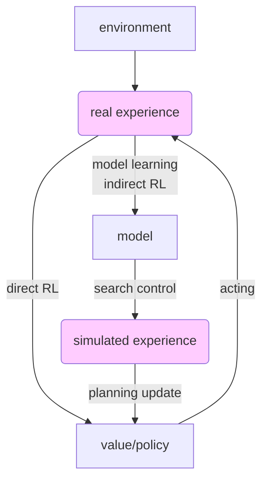

## chapter8 Planning and Learning with Tabular Methods

This is the last chapter of Part 1 Tabular Solution Method, although no new algorithm is raised up, the goal is to unify model-based mathods(like DP) and model-free method(like MC, TD) and see how they can be intermixed. Also, review the key concepts and prepare to move to part 2.

#### 8.1 models and planning
*model* of an env: anything that an agent can use to predict how the env will respond to its action. Models are used to produce *simulated experience*.
+ disrtibution model: all possibilities and their probabilities are know
+ sample model: produce samples according to these probabilities

*planning*: computational process that takes a model as input ad produce or improve a policy for interacting with model env.

#### 8.2 Dyna: integrated planning, acting and learning
For model-based method, new information(experience) gained from interaction may change the model thereby interacting with planning.

Real experience can influence value function directly and indirectly via model. Policy and value updation comes from both plannng(simulated experience) and learning(real experience), only differing in source of the experience(direct env/model).

Tabular Dyna-Q
> Initialize $Q(s,a)$ and $Model(s,a)$ for all $s\in\mathcal S$ and all $a\in\mathcal A(s)$
> Loop forever:
> &emsp; (a) $S\leftarrow$current states
> &emsp; (b) $A\leftarrow\varepsilon$-greedy$(S,Q)$
> &emsp; (c) take action $A$, observe reward $R$ and state $S^\prime$
> &emsp; (d) $Q(S,A)\leftarrow Q(S,A)+\alpha[R+\gamma \max_a Q(S^\prime,a)-Q(S,A)]$  (direct Learning)
> &emsp; (e) $Model(S,A)\leftarrow (R,S^\prime)$  (update model, assuming deterministic env and always remember the latest transition)
> &emsp; (f) Loop repeat $n$ time:(experience repetition):
> &emsp;&emsp; $S\leftarrow$random previously observed states
> &emsp;&emsp; $A\leftarrow$random action previously taken in $S$
> &emsp;&emsp; from model get the transition: $R,S^\prime\leftarrow Model(S,A)$
> &emsp;&emsp; update value from planning: $Q(S,A)\leftarrow Q(S,A)+\alpha[R+\gamma \max_a Q(S^\prime,a)-Q(S,A)]$

The main contribution of model here is to memorize past experience and speed up the gain propagation from the end of episode to the early states. Since it can work parallelly with the real interaction with env, it is better than n-step TD which requiring delay updations.

#### 8.3 when the model is wrong
When env is stochastic or changing, then model generated from past experience is incorrect. In order to keep tracking the env while interacting with it, the action need exploring more on which are rarely been visited.

*Dyna-Q+* keeps tracking for each state-action pair of how many time steps have elapsed since the pair was last tried in a real interaction with the env. The more time steps elapsed, the greater chance the dynamic of this pair has changed and that the model is incorrect. This algorithm promotes exploring action which is long-untried by giving extra bonus on the reward: $r+\kappa\sqrt{\tau}$,$\tau$ is the elapsed time steps.

Note that the bonus reward is counted not only in action selection: $\rm arg\max_a Q(S_t,a)+\kappa\sqrt{\tau(S_t,a)}$, but also the action value updating. Using bonus reawrd instead of real reward in value updation is to promote exploring in long path than simply apply bonus reward in action selection.(Excercise 8.4).

#### 8.4 prioritized sweeping
For large state space, uniformly random selection in planning will be too inefficient. Instead, some states are more urgent or more prioritized to be updated over others, due to its variates are much larger. It's more likely the predecessors of these states are also have large variates to be updates. We build a priority queue storing the $(S,A)$ pair and their priority $P$, for a $(S,A)$ pair whose $P>\theta$, we can push it into the queue.

Prioritized sweeping for a deterministic env
> Initialize $Q(s,a)$ and $Model(s,a)$ for all $s\in\mathcal S$ and all $a\in\mathcal A(s)$ and a $P$-queue to empty
> Loop forever:
> &emsp; (a) $S\leftarrow$current states
> &emsp; (b) $A\leftarrow\varepsilon$-greedy$(S,Q)$
> &emsp; (c) take action $A$, observe reward $R$ and state $S^\prime$
> &emsp; (d) $Model(S,A)\leftarrow (R,S^\prime)$  (update model, assuming deterministic env and always remember the latest transition)
> &emsp; (e) calculate $P$ as its improve if updated: $P\leftarrow |R+\gamma \max_a Q(S^\prime,a)-Q(S,A)|$
> &emsp; (f) if $P>\theta$, insert $S,A$ into $P$-queue with priority $P$
> &emsp; (g) Loop repeat $n$ time:(experience repetition) while $P$-queue is not empty:
> &emsp;&emsp; $S,A\leftarrow$head of $P$-queue
> &emsp;&emsp; $R,S^\prime\leftarrow Model(S,A)$
> &emsp;&emsp; from model get the transition: $R,S^\prime\leftarrow Model(S,A)$
> &emsp;&emsp; update value from planning: $Q(S,A)\leftarrow Q(S,A)+\alpha[R+\gamma \max_a Q(S^\prime,a)-Q(S,A)]$
> &emsp;&emsp; Loop for all $\bar{S},\bar{A}$ predicted to lead to $S$(check all predecessors, if their priority is urgent enough):
> &emsp;&emsp;&emsp; $\bar{R}\leftarrow$predicted reward for $\bar{S},\bar{A},S$
> &emsp;&emsp;&emsp; $P\leftarrow |R+\gamma \max_a Q(S^\prime,a)-Q(S,A)|$
> &emsp;&emsp;&emsp; if $P>\theta$, insert $\bar{S},\bar{A}$ into $P$-queue.

All kind of state-space planning can be viewed as sequences of value updates, varying only
+ in type of update:
  - expected
  - sample
+ in the order in which updates are done:
  - uniformly random
  - prioritized sweeping
  - forward focusing

#### 8.5 expected vs. sample updates
If computational cost is not concerned, then expected update is better than sample update due to eliminate of sampling error. But this section argues that sample update can achieve much faster improvemnt by:
+ updating same $(S,A)$ much times before a complete expected update(have to calculate all possible successive states, let's say $b$ is the number of successive states whose transition posibilities are greater than zero), and cost steps$\ll b$ when $b$ is sufficiently large to achieve the same accuracy with expected update(which will cost $b$ computations).
+ during the process of updating $(S,A)$, other state-action pairs are also updated which are the possible successive states, their values are more accurate will reversely help the estimates of $(S,A)$.

#### 8.6~8.11
following sections are trival, just list these main points:
+ for heuristic search(decision-time planning), focusing more computational and memory resources on current state(updating value function and policy only conditioned on current state) is more efficient.
+ *trajectory sampling*: from current state, sampling state and reward transitions from model and sampling actions from current policy. Agent simulates individual trajectory(e.g.$S_t,A_t,R_{t+1},S_{t+1},A_{t+1},R_{t+1}...$)
and perform updates at states or state-action pairs along the way.
+ *rollout algorithm*: decision-time planning, based on MC control. From current state, simulate trajectories. To estimate action values from current state, simply averaging the returns of trajectories who start with each possible action(and then follow the given policy, since trajectories generating by sampling from policy distribution); the action having the highest estimated value is selected and executed. After the immediate use of action values, rollout algorithm discards them and shift to next state. Note that, although the trajectories generated in time step $t$ follows policy in time step $t$, we select $A_t$ using maximization operation which will deviate action policy from $\pi_t$. But this will satisfy the *policy improvement theorem*, step-by-step, given policy is improved little at a time. So the goal of rollout is not to find optimal policy, but improve upon rollout policy.
+ **MCTS: Monte Carlo Tree Search**: which is the algorithm of AlphaGO~ MCTS is also a rollout, but instead of only maintain a root node, MCTS will maintain a tree(containg root node and nodes also leaves), but not for all possible states or state-action pairs, but only subset of state-action pairs that are most likely to be reached in few step(close to the root node). The extension of the tree(by adding state node) is by only adding states that looks promising(have high value based on simulated trajactories). The tree represents out past estimates which we believe are quite accurate. So the new trajectories simulations can be splited into 2 parts:
  - inside the tree, action is selected from tree policy(such as $\varepsilon$-greedy to maintain basic exploration, acoording to the action value)
  - from the leaf node, or outside of the tree, simulation from rollout policy
Trajactories returns backed up to update action values in the tree, but not states value. Then estmates outside of the tree are discarded like rollout.
