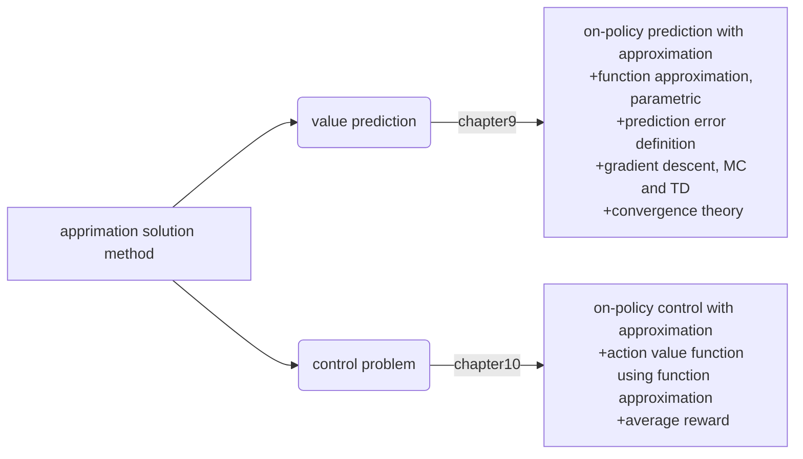

## chapter10 On-policy Control with Approximation

Parameterize action function $\hat{q}(s,a,{\rm w})=q_*(s,a)$, extend from state value function in the last chapter, still in on-policy condition.
- episodic case, control problem still following GPI framework
- continuing case: give up discounting and switch to average rewards

Where are we?

#### 10.1 episodic semi-gradient control
Instead of modeling $S_t\mapsto U_t$, now we mapping $S_t,A_t\mapsto U_t$.
$${\rm w_{t+1}}={\rm w_t}+\alpha[U_t-\hat{q}(S_t,A_t,{\rm w_t})]\nabla \hat{q}(S_t,A_t,{\rm w_t})\qquad(10.1)$$
And for TD(0) Sarsa:
$${\rm w_{t+1}}={\rm w_t}+\alpha[R_{t+1}+\gamma \hat{q}(S_{t+1},A_{t+1},{\rm w_t})-\hat{q}(S_t,A_t,{\rm w_t})]\nabla \hat{q}(S_t,A_t,{\rm w_t})\quad(10.2)$$

For policy improvement and action selection(e.g. $\varepsilon$-greedy), if action is discrete and the action space is not large, then method in part1 works still well, $A_t^*={\rm arg}\max_a \hat{q}(S_t,a,{\rm w_t})$.

#### 10.2 semi-gradient n-step Sarsa
Generalize TD(0) Sarsa to TD(n-1) Sarsa:
$$G_{t:t+n}=R_{t+1}+\gamma R_{t+2}+\cdot\cdot\cdot+\gamma^{n-1}R_{t+n}+\gamma^n \hat{q}(S_{t+n},A_{t+n},{\rm w_{t+n-1}}),\; t+n<T,(10.4)\\
G_{t:t+n}=G_t,\,t+n\ge T\\
{\rm w_{t+1}}={\rm w_t}+\alpha[G_{t:t+n}-\hat{q}(S_t,A_t,{\rm w_t})]\nabla \hat{q}(S_t,A_t,{\rm w_t}),\; 0\le t<T\quad(10.5)$$

(Exercise 10.3) In initial episodes, for TD(n-1), large n usually have large variance due to more random choices in the beginning when the action value estimations are not accurate enough and the large n will lead to slower updations and including more $bad$ actions or states as target values.

#### 10.3 average rewards: a new problem setting for continuous tasks
Now use average reward rather than discounted sum of rewards to measure policies.
$$r(\pi)=\lim_{h\rightarrow \infty}\frac{1}{h}\sum_{t=1}^h \Bbb E[R_t|S_0,A_{0:t-1}\sim \pi]\qquad(10.6)\\
=\lim_{h\rightarrow \infty} \Bbb E[R_t|S_0,A_{0:t-1}\sim \pi]\qquad\,\,(10.7)\\
=\sum_s \mu_\pi(s)\sum_{a}\pi(a|s)\sum_{s^\prime,r}p(s^\prime,r|s,a)r\,$$

Expectetaion is conditioned on initial state $S_0$ and subsequent actions following policy $\pi$.

Here, $\mu_\pi$ is the steady state distribution $\mu_\pi(s)=\lim_{t\rightarrow\infty}{\rm Pr}(S_t=s|A_{0:t-1}\sim \pi)$, note that the steady state is not conditioned on initial state or any early state. This property is *ergodicity*, any early states only make tenporary effect, in the long run, only policy and transition probability matter. Once in steadt state:
$$\sum_s \mu_\pi(s)\sum_a \pi(a|s)p(s^\prime|s,a)=\mu_\pi(s^\prime)\qquad(10.8)$$

In average reward setting, returns are defined in differences between rewards and average reward without discount:
$$G_t=R_{t+1}-r(\pi)+R_{t+2}-r(\pi)+\cdot\cdot\cdot\qquad(10.9)$$
Equation (10.9) is differential return, and $v_\pi(s)=\Bbb E_\pi[G_t|S_t=s]$ and $q_\pi(s,a)=\Bbb E_\pi[G_t|S_t=s,A_t=a]$ are differential value functions. Bellman equations under average reward setting:
$$v_\pi(s)=\sum_a \pi(a|s)\sum_{s^\prime,r}p(s^\prime,r|s,a)[r-r(\pi)+v_\pi(s^\prime)]\\
q_\pi(s,a)=\sum_{s^\prime,r}p(s^\prime,r|s,a)[r-r(\pi)+\sum_{a^\prime}\pi(a^\prime|s^\prime)q_\pi(s^\prime,a^\prime)]\\
v_*(s)=\max_a\sum_{s^\prime,r}p(s^\prime,r|s,a)[r-\max_\pi r(\pi)+v_*(s^\prime)]\\
q_*(s,a)=\sum_{s^\prime,r}p(s^\prime,r|s,a)[r-\max_\pi r(\pi)+\max_{a^\prime}q_*(s^\prime,a^\prime)]
$$
For Sarsa(0) TD errors:
$$\delta_t=R_{t+1}-\bar{R}_t+\hat{v}(S_{t+1},{\rm w_t})-\hat{v}(S_t,{\rm w_t})\qquad(10.10)\\
\delta_t=R_{t+1}-\bar{R}_t+\hat{q}(S_{t+1},A_{t+1},{\rm w_t})-\hat{q}(S_t,A_t,{\rm w_t})\quad(10.11)\\
\bar{R}_t=\sum_s\mu_t(s)\sum_a\pi(a|s)\sum_{s^\prime,a}p_t(s^\prime,r|s,a)r\quad(\rm excercise10.5)
$$
Update weight vetor:
$${\rm w_{t+1}}={\rm w_t}+\alpha\delta_t\nabla \hat{q}(S_t,A_t,{\rm w_t})\qquad(10.12)$$

Differential semi-gradient Sarsa(0) for estimating $\hat{q}\approx q_*$
> Input: a differentiable parameterized action function: $\hat{q}:\mathcal S\times \mathcal A\times\Bbb R_d\rightarrow\Bbb R$
> Input parameters $\alpha, \beta>0$
> Initialize value-function weights $\rm w$ and average reward $\bar{R}$
>
> Initialize $S$ and $A$
> Loop for each step:
> &emsp; Take action $A$, observe $R,S^\prime$
> &emsp; Choose $A^\prime$ as a function of $\hat{q}(S^\prime,.,{\rm w})$(e.g. $\varepsilon$-greedy)
> &emsp; $\delta\leftarrow R-\bar{R}+\hat{q}(S^\prime,A^\prime,{\rm w})-\hat{q}(S,A,{\rm w})$
> &emsp; update average reward: $\bar{R}\leftarrow\bar{R}+\beta\delta$
> &emsp; ${\rm w}\leftarrow{\rm w}+\alpha\delta\nabla\hat{q}(S,A,{\rm w})$
> &emsp; $S\leftarrow S^\prime$
> &emsp; $A\leftarrow A^\prime$

#### 10.4 deprecating and discounted setting
Since function approximation sometimes can not make differences among states, only feature vectors are given, so we have no reason to distinguish rewards for each state, just treat them all equally. In such sense, discounting and averaging are just proportional with a limit factor $\frac{1}{1-\gamma}$.

Discounted control setting lose policy improvement setting if function approximation is used(since update weights will influence all states' value rather than current state' value). Not only discounted control setting, but average reward setting is also true! *Function Approximation no longer garantees improvement for any setting*.

#### 10.5 differential semi-gradient n-step Sarsa
Sarsa(n-1) error:
$$\delta_t=R_{t+1}-\bar{R}_{t+n-1}+R_{t+2}-\bar{R}_{t+n-1}+\cdot\cdot\cdot+R_{t+n}-\bar{R}_{t+n-1}+\hat{q}_{t+n-1}(S_{t+n},A_{t+n},{\rm w_t})-\hat{q}_{t+n-1}(S_t,A_t,{\rm w_t})$$

Differential semi-gradient Sarsa(n--1) for estimating $\hat{q}\approx q_*$
> Input: a differentiable parameterized action function: $\hat{q}:\mathcal S\times \mathcal A\times\Bbb R_d\rightarrow\Bbb R$
> Input parameters $\alpha, \beta>0$
> Initialize value-function weights $\rm w$ and average reward $\bar{R}$
>
> Initialize $S_0$ and $A_0$
> Loop for each step $t=0,1,2,3,...$:
> &emsp; Take action $A_t$, observe $R_{t+1},S_{t+1}$
> &emsp; Choose $A_{t+1}$ wrt $\hat{q}(S_{t+1},.,{\rm w})$(e.g. $\varepsilon$-greedy)
> &emsp; $\tau\leftarrow t-n+1$
> &emsp; if $\tau\ge 0$:
> &emsp;&emsp; $\delta\leftarrow \sum_{i=\tau+1}^{\tau+n}(R_i-\bar{R})+\hat{q}(S_{\tau+n},A_{\tau+n},{\rm w})-\hat{q}(S_\tau,A_\tau,{\rm w})$
> &emsp; update average reward: $\bar{R}\leftarrow\bar{R}+\beta\delta$
> &emsp; ${\rm w}\leftarrow{\rm w}+\alpha\delta\nabla\hat{q}(S,A,{\rm w})$
> &emsp; $S\leftarrow S^\prime$
> &emsp; $A\leftarrow A^\prime$
