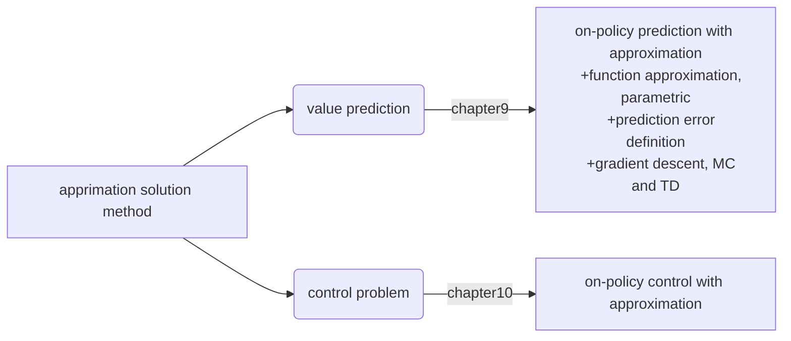

## chapter 9 On-policy Prediction with Approximation

This is the first chapter of part2: Approximate Solution Methods.
For large state space(or infinite state space), it's impossible to find optimal policy or optimal value function in finite computational time. Instead, a good *approximate* solution is researched.

Since the state space is that large, states encountered before may never repeat in the future, so the learning needs to be able to generalize from history which they are not the same but similar is some sense, which is the key of *supervised learning* for *generalization*. With samples in the past(pieces of complete value/policy function), try to estimate entire function, which is *function approximation*.

Chapter9 focused on value prediction, assuming policy is given. Consider using function approximation to estimate $v_\pi$ from data generated from polocy $\pi$. The form of $v_\pi$ is not a table, instead a parameterized function with $\rm w\in\Bbb R^d$ as weight vector and takes the format of $\hat{v}(s,\rm w)\approx v_\pi$. To see how we simplfy the problem, the dimension of weights are much smaller than states: $d\ll|\mathcal S|$.

Where are we?

#### 9.1 value function approximation
In part1, we update value function once(a sample) a little to its goal($s\mapsto u$, estimated value should be more close to the target $u$):
+ TD(n-1): $S_t\mapsto G_{t:t+n}$  
+ MC: $S_t\mapsto G_t$
+ DP: $S_t\mapsto \Bbb E_\pi[R_{t+1}+\gamma \hat{v}(S_{t+1},\rm w_t)|S_t=s]$

Only state being updated shifting a fraction($\alpha$) toward $u$, the estimated values of all other state stays unchanged.(modify state's own paramter, or just think every state own its single parameter, which is its value; different states don't share parameters)

Here, to implement function approximation, we use $s\mapsto g$ as a training sample. For RL, the challenge is the function being approximated is nonstationay:
+ the env the agent interacts with is changing, can function trained with past data fits well in new env?
+ the policy we follow and generate samples are changing(recall GPI: we hold value estimation and policy estimation and update them in turn based on the other's update)
+ within the prediction scope(assume given policy), since boostrapping is used(like DP and TD), the target of function($g(s)$) is changing, too; samples itself is nonstationary.

The function approximation method needs to learn effectively from *incrementally acquired data* and easily handle nonstationary data.

#### 9.2 the prediction objective($\bar{VE}$)
To measure the prediction error, for each state, $\mu(s)$ is a distribution representing how much we care about the error in each state $s$.
$$\bar{VE}({\rm w})=\sum_{s\in \mathcal S}\mu(s)[\hat{v}(s,{\rm w})-v_\pi]^2\qquad(9.1)$$

The square root of $\bar{VE}$ is prediction error. And $\mu(s)$ can be chosen as the fraction of time spent in $s$, which *on-policy distribution*.

Despite $\bar{VE}$ is simple and straightforward, but it may still not be the best performance objective, since the gaol is to find a good policy instead of minimizing prediction error.

#### 9.3 stochastic-gradient and semi-gradient methods
**SGD**
+ ${\rm w}=(w_1,w_2,...,w_d)^{\mathsf T}$
+ $\hat{v}(s,\rm w)$ is differentiable of $\rm w$ for all $s\in\mathcal S$, since RL is in time-series sense, so denote $rm w_t$ as the weight vector in time step $t$
+ $S_t\mapsto v_\pi(S_t)$ is the sample observed in time $t$ under policy $\pi$
$\bigstar$ the sample usually contain noise:
  - $v_\pi(S_t)$ may no be correct
  - need to generalize estimates for new states
+ for every single sample, modify weight vector instead of value function itself(if think $\hat{v}(S_t)$ as a parameter corresponding to $S_t$, then it's the same):
$${\rm w_{t+1}}={\rm w_t}-\frac{1}{2}\alpha\nabla[v_\pi(S_t)-\hat{v}(S_t,{\rm w_t})]^2\qquad(9.4)\\={\rm w_t}+\alpha[v_\pi(S_t)-\hat{v}(S_t,{\rm w_t})]\nabla {\hat{v}(S_t,{\rm w_t})}\qquad(9.5)$$
+ the convergence(to local optimum) of SGD assumes that $\alpha$ decreases over time.

Loose the condition, for noise-corrupted label $U_t$, which is a random approximate for $v_\pi(S_t)$, since $v_\pi$ is the expected value, so sure random noise could exist. But only if $\Bbb E[U_t|S_t]=v_\pi(S_t)$, still using could garantee local optimum convergence under same conditions
$${\rm w_{t+1}}={\rm w_t}+\alpha[U_t-\hat{v}(S_t,{\rm w_t})]\nabla {\hat{v}(S_t,{\rm w_t})}\qquad(9.7)$$
Since MC's target $G_t$ is an unbiased approximate of $v_\pi$, so MC can garantee local optimum.

**semi-gradient**
For boostrapping, such as TD(n-1) and DP, the targets are biased, since they are estimates and not independent of $\rm w_t$. Equation (9.7) is semi-gradient instead of true GD.

Although semi-gradient doesn't garantee convergence, but it still have advantages:
+ faster learning
+ continual and online(fast update)

#### 9.4 linear methods
*feature vector, basis function*
$${\rm x(s)}=(x_1(s),x_2(s),...,x_d(s))^{\mathsf T}, x_i: \mathcal S\rightarrow \Bbb R$$
*linear in weight*
$$\hat{v}(s,{\rm w})={\rm w}^{\mathsf T}{\rm x(s)}=\sum_{i=1}^d w_ix_i(s)\qquad(9.8)\\
\nabla \hat{v}(s,{\rm w})={\rm x(s)}\\
{\rm w_{t+1}}={\rm w_t}+\alpha[U_t-\hat{v}(S_t,{\rm w_t})]{\rm x}(S_t)$$

For linear function space, only one optimum exists, so convergence to local optimum is equal to convergence to global optimum.

Since on-policy MC is not bosstrapping ,so it can converge to global optimum. Bt on-policy TD converges to a point near the local optimum, which is *TD fixed point*.
$${\rm w_{t+1}}={\rm w_t}+\alpha(R_{t+1}+\gamma {\rm w_t}^{\mathsf T}{\rm x_{t+1}}-{\rm w_t}^{\mathsf T}{\rm x_{t}}){\rm x_t}\qquad(9.9)\\
={\rm w_t}+\alpha(R_{t+1}{\rm x_t}-{\rm x_t({\rm x_t}-\gamma {\rm x_{t+1}})^{\mathsf T}{\rm w_t}})$$

If convergence is reached, $\Bbb E[R_{t+1}{\rm x_t}-{\rm x_t({\rm x_t}-\gamma {\rm x_{t+1}})^{\mathsf T}{\rm w_t}}]=\rm 0$.
${\rm b}=\Bbb E[R_{t+1}{\rm x_t}]\in \Bbb R_d$, ${\rm A}=\Bbb E[{\rm x_t({\rm x_t}-\gamma {\rm x_{t+1}})^{\mathsf T}}]\in \Bbb R^d\times \Bbb R^d$, the stable weight vector is $\rm w_{TD}$. Then
$${\rm b-Aw_{TD}=0}\\\rm w_{TD}=A^{-1}b\qquad(9.12)$$
To ensure the inverse is legal, $\rm A$ should be positive definite. At fixed point:
$$\bar{VE}({\rm w_{TD}})=\frac{1}{1-\gamma}\min_{\rm w}\bar{VE}(\rm w)\qquad(9.14)$$
On-policy boostrapping methods can usually apply to TD fixed point, but off-policy boostrapping can diverge to infinity!

Key update equation:
$${\rm w_{t+n}}={\rm w_{t+n-1}}+\alpha[G_{t:t+n}-\hat{v}(S_t,{\rm w_{t+n-1}})]\nabla\hat{v}(S_t,{\rm w_{t+n-1}}),0\le t\le T\quad(9.15)\\
G_{t:t+n}=R_{t+1}+\gamma R_{t+2}+\cdot\cdot\cdot+\gamma^{n-1}R_{t+n}+\gamma^n \hat{v}(S_t,{\rm w_{t+n-1}}),0\le t\le T-n\quad(9.16)$$

#### 9.5 feature construction for linear methods
pass, feature engineering is field specific.

#### 9.6 selecting step-size parameters manually
A rule of thumb for linear SGD:
$$\alpha=\Bbb E[\tau \rm x^{\mathsf T}x]^{-1}\qquad\qquad(9.19)$$
$\tau$ is the number of samples with the same feature vector $\rm x$.

#### 9.7 nonlinear function approximation: ANN
pass, NN methods are not central topic here.

#### 9.8 Least-Square TD
Closed-format of TD fixed point estimaion, but not recomended in this book.

#### 9.9 memory-based function approximation
Memory-based function approximation is nonparametric method. Instead of training model to fit and predict mapping from state(or features of state) to value, it just save past samples and select samples who are close or similar to the new state the agent encounters and use their values to predict the new state's value.

*local learning*: estimate value function only locally in the neighborhood of current query state. Usually use "distance" to judge relevance.
+ nearest-neighbor
+ weighted average
+ locally weighted regression

The advantages are:
+ suitable for RL, memory-based method can focus function approximation on local neighborhoods of states visited in real of simulated trajectories
+ maybe no need for global approximation

But the speed to get "neighbors" is a problem when sample size increases.

#### 9.10 kernel-based function approximation
Distance-relevance mentioned in pre section is like a special case for kernel.
*kernel function*: the function assigns weights to examples $s^\prime \mapsto g$.
- distance weight: $k: \Bbb R\rightarrow \Bbb R$
- more general, weights can depend on any similarity measurement between states: $k: \mathcal S \times \mathcal S\rightarrow \Bbb R$, $k(s,s^\prime)$ is the weight given to state $s^\prime$ in its influence on answering queries about $s$, or is a measure of stength of generalization from $s^\prime$ to $s$.

If RBF(two parameters, center and volatility) is used as kernel function, the center and volatility of each degree of feature vector $\rm x$ can be estimated from training samples.

Connect "kernel trick" with SVM for dimension reduction purpose.

#### 9.11
pass, feel like redundant
